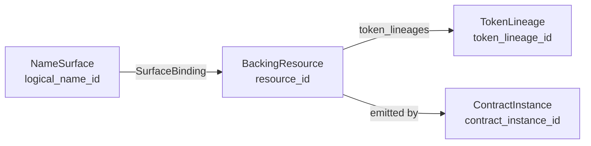
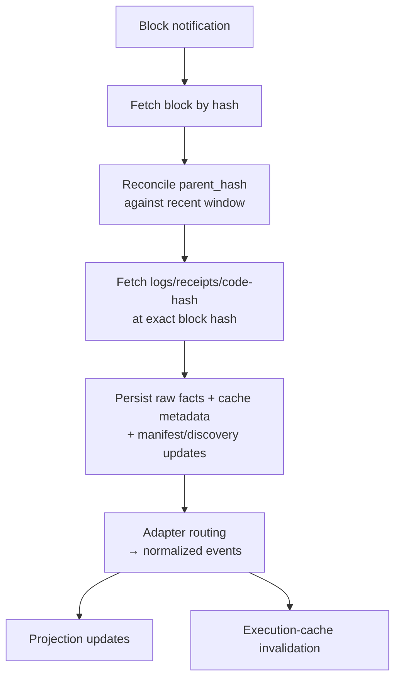

# Architecture

bigname is a replayable index and read API for ENS (v1 and v2) and Basenames. This doc describes the model that everything else implements: identities, namespaces, source families, normalised events, the resolution and permissions models, and what verified support actually means.

The wire format lives in [`api-v1.md`](api-v1.md). Persistence rules live in [`storage.md`](storage.md). Manifests, intake, projections, and verified execution have their own files. Implementation sequencing and parallel-work boundaries live under [`internal/`](internal/). Upstream pin policy and citation format live in [`upstream.md`](upstream.md).

## What we're building

For any supported name or address at any supported chain position, the API returns one envelope that tells the caller:

- the answer
- where it came from (provenance)
- how complete the answer is (coverage and exhaustiveness)
- the chain positions it was computed against
- when it was last updated

Every answer is reorg-safe, replayable from raw facts, and explicit about what isn't supported. The API is a native `v1` REST contract — not a legacy ENSv1 subgraph parity layer.

## Namespaces

Public namespaces are exactly two:

- `ens` — ENSv1 and ENSv2, treated as authority epochs of one product.
- `basenames` — Basenames-issued `*.base.eth` on Base[^bn-readme-l70].

`base.eth` itself stays under `ens` because upstream treats it as the L1 root domain handled by the Mainnet `L1Resolver`[^bn-l1resolver-l13][^bn-l1resolver-l154].

Namespace assignment runs through an internal registry with versioned rules, in priority order: exact-name match, suffix match, authority root. Initial policy:

| Pattern | Namespace |
|---|---|
| exact `base.eth` | `ens` |
| `*.base.eth` | `basenames` |
| other supported ENS surfaces | `ens` |

Conflicts reject canonical admission; namespace assignment happens before `logical_name_id` is minted. Profile selection (mainnet, `sepolia-dev`) is separate from namespace — one runtime serves one profile at a time.

## Identities

Four identity layers, each with their own continuity rules.

### `logical_name_id`

The public surface identity, written `<namespace>:<normalized_name>` (e.g. `ens:wallet.linked.parent.eth`, `basenames:alice.base.eth`). Stable across backing-resource rotation, token regeneration, lapses, and re-registrations.

### `resource_id`

Stable identity for the backing authority object. Permissions, control, and resolver-scoped grants anchor here. Opaque UUID.

| Namespace | What `resource_id` anchors |
|---|---|
| ENSv1 | The active authority anchor: registry-only, registrar-backed lease, or wrapper-backed control. Persists across holder/controller/resolver/expiry/grace/fuse/status changes. Rotates only when authority moves between anchor kinds (wrap, unwrap, full lapse + re-registration). |
| ENSv2 | The upstream EAC resource, not the current ERC-1155 token ID. The registry exposes `getResource(anyId)` and emits `TokenResource`/`TokenRegenerated`[^v2-iperm-l34][^v2-events-l69]. |
| Basenames | The Base-side authority object, even when L1 compatibility transport participates[^bn-readme-l70][^bn-l1resolver-l13]. |

If authority returns to a prior anchor (e.g. unwrap back to the original lease), the prior `resource_id` is reused.

### `token_lineage_id`

Tokenized ownership history. Token IDs may change while the resource doesn't; lineage outlives the ID.

- ENSv1: registry-only control has no lineage. Registrar leases and wrapper positions each mint one. Renewals/transfers/expiry/grace within the same anchor preserve it; moving to a different tokenized anchor rotates it.
- ENSv2: preserved across `TokenRegenerated`. Resource identity is anchored by upstream `eacVersionId`; tokens are versioned by `tokenVersionId`. Unregister/re-register increments both; regeneration increments only the token version[^v2-pr-l28][^v2-pr-l451][^v2-pr-l536].

### `contract_instance_id`

Stable identity for registry, registrar, resolver, wrapper, and transport instances. Minted when a manifest-declared or discovery-admitted contract first enters the canonical source graph. One admitted address on one chain has one `contract_instance_id` across all admission epochs; re-admission after an inactive gap reuses the prior id with a new active range.

A proxy and its implementation are separate instances linked by a time-ranged proxy/implementation edge. Implementation churn updates the edge, not the proxy identity.

## Surfaces, bindings, and authority

`NameSurface` is the canonical row per `logical_name_id`. It holds the admitted identity and one canonical normalisation result (`canonical_display_name`, `normalized_name`, `dns_encoded_name`, `namehash`, `labelhashes`, `normalizer_version`, plus normalisation warnings/errors). Per-observation spellings stay as immutable `PreimageObserved` facts and normalised events.

`SurfaceBinding` records how a public surface binds to a backing resource over time. Each row carries `surface_binding_id`, `logical_name_id`, `resource_id`, `binding_kind`, an active range, provenance, and canonicality state.

Binding kinds:

`declared_registry_path`, `linked_subregistry_path`, `resolver_alias_path`, `observed_wildcard_path`, `migration_rebind`, `observed_only`.

A new `SurfaceBinding` row appears only when the bound `resource_id` changes. Lifecycle within the same anchor — transfer, renewal, expiry, grace, fuse changes — does not create new bindings.

Worked example for ENSv1:

| Event | `resource_id` | `token_lineage_id` |
|---|---|---|
| Registry-only `sub.alice.eth` | one registry-anchored | none |
| Register `alice.eth` | one registrar-anchored | mint registrar lineage |
| Wrap `alice.eth` | close registrar binding, open wrapper-anchored | mint wrapper lineage |
| Unwrap before lease ends | reactivate prior registrar | reactivate prior registrar lineage |
| Expiry / grace | unchanged | unchanged |
| Re-registration after lapse | new registrar anchor | new registrar lineage |

This separation is what lets us represent: one resource under multiple public names; alias-resolved names with no direct registry entry; observed wildcard names; and surfaces that rebind across time.

## Source families

A source family owns a slice of upstream behaviour. Capability ownership attaches to the declaring family — never implied by another family's presence.

### ENS

| Family | Owns |
|---|---|
| `ens_v1_registry_l1` | Mainnet registry + migration-aware `ENSRegistryOld` input |
| `ens_v1_registrar_l1` | `.eth` BaseRegistrar; legacy/wrapped/current registrar-controllers as label-bearing intake |
| `ens_v1_wrapper_l1` | Mainnet NameWrapper authority, fuses/expiry, wrapper-revealed names |
| `ens_v1_resolver_l1` | Admitted ENS Labs PublicResolver-generation profiles |
| `ens_v1_reverse_l1` | Mainnet ReverseRegistrar — declared reverse-claim intake |
| `ens_dns_l1` | DNS imports (reserved) |
| `ens_offchain_metadata` | Metadata observations (reserved) |
| `ens_v2_root_l1` | ENSv2 `RootRegistry` (sepolia-dev) |
| `ens_v2_registry_l1` | ENSv2 `ETHRegistry` plus discovered `UserRegistry` |
| `ens_v2_registrar_l1` | ENSv2 `ETHRegistrar` |
| `ens_v2_resolver_l1` | ENSv2 `PermissionedResolver` |
| `ens_execution` | Verified resolution at the official Universal Resolver proxy `0xeEeEEEeE…EeEe`[^ens-docs-univ] |

### Basenames

| Family | Owns |
|---|---|
| `basenames_base_registry` | Per-node owner/resolver/TTL state on Base |
| `basenames_base_registrar` | Tokenized authority for `*.base.eth` on Base |
| `basenames_base_resolver` | Default `L2Resolver` profile seed |
| `basenames_base_primary` | Declared primary-claim intake (claim only — does not widen exact-name truth)[^bn-revreg-l12] |
| `basenames_l1_compat` | L1 compatibility transport for `base.eth` |
| `basenames_execution` | Verified-resolution entrypoint (same L1 Resolver address as `basenames_l1_compat`, different ownership) |
| `basenames_offchain` | Reserved; not currently admitted |

### Shared

`shared_manifests`, `shared_normalization_rules`, `shared_capability_registry`.

Address-level admission detail and the per-generation PublicResolver table live in [`manifests.md`](manifests.md). The Universal Resolver split between proxy entrypoint and pinned implementation is documented in [`upstream.md`](upstream.md).

## Manifests and discovery

Manifests pin each source family by version under `manifests/<namespace>/<source_family>/<version>.toml`. Alternate profiles use a profile-specific root (e.g. `manifests-sepolia-dev/`); one runtime selects exactly one. A manifest contains `manifest_version`, `namespace`, `source_family`, `chain`, `deployment_epoch`, `rollout_status` (`draft`/`shadow`/`active`/`deprecated`), `normalizer_version`, `capability_flags` (`unsupported`/`shadow`/`supported`), `roots`, `contracts`, and `discovery_rules`. Schema and per-namespace ownership live in [`manifests.md`](manifests.md).

Discovery expands the canonical source graph through time-versioned reachability edges: resolver, subregistry, parent, alias, metadata, proxy/implementation, migration, transport. Each edge stores `from_contract_instance_id`, `to_contract_instance_id`, kind, active range, provenance, and canonicality. The watch plan starts from active root contract instances and traverses by edge id; address-only watch rows are derived state, not durable identity.

Manifest changes are normalised events: `SourceManifestUpdated`, `ProxyImplementationChanged`, `CapabilityChanged`. They invalidate execution cache entries and trigger projection rebuilds where capability boundaries change.

## Intake architecture

For one selected profile, three intake planes run in parallel:

- Ethereum L1 chain intake
- Base chain intake
- execution intake (verified reads, CCIP)

Per-profile provider availability is an explicit operational state. A profile that selects a Base chain but has no Base provider configured leaves Base intake idle with `no_provider`; it does not block startup for the other chains.

Postgres is the hot indexed and replay-focused store. Lineage anchors, selected target logs, replay-required call snapshots, code-hash observations, and compact payload-cache metadata are durable. Large block payloads, non-indexed transaction or receipt bodies, and non-audit raw-log staging rows are evictable cache once their replay contract is satisfied.

Backfill enters as bounded persisted jobs with resumable range checkpoints and uses the same pipeline as live intake. Range checkpoints are operational state; they never advance `canonical_head`, `safe_head`, or `finalized_head`.

Detail lives in [`chain-intake.md`](chain-intake.md).

## Immutable facts vs rebuildable state

The two halves of the system:

| Immutable | Rebuildable |
|---|---|
| blocks, transactions, receipts, logs | current name surface snapshot |
| contract code hashes | surface-binding snapshot |
| manifests, discovery edges | authority/registration snapshot |
| normalised events | control snapshot |
| normalisation results, preimage observations | permissions snapshot |
| selected `eth_call` snapshots | resolver topology |
| CCIP request/response digests | record inventory + cache |
| verification outcomes | primary-name snapshot |
| metadata responses | reverse and address indexes |
| sync cursors | resolver indexes |
|  | history materializations |
|  | coverage snapshots |
|  | execution cache |

Every projected row carries provenance pointers, manifest version, canonicality state, and chain-position context. For large payloads, the durable fact may be selected replay fields plus optional cache metadata or a digest, not the full body.

## Normalised events

Adapters emit normalised events; projection workers consume them. The taxonomy:

| Group | Events |
|---|---|
| Identity / preimage / discovery | `PreimageObserved`, `NameClassified`, `SurfaceBound`, `SurfaceUnbound`, `ContractDiscovered`, `MetadataChanged`, `SourceManifestUpdated` |
| Registration / authority | `RegistrationReserved/Granted/Renewed/Released`, `ExpiryChanged`, `AuthorityTransferred`, `AuthorityEpochChanged`, `MigrationApplied`, `CommitmentMade`, `PricingPolicyChanged` |
| Lineage / control | `TokenResourceLinked`, `TokenRegenerated`, `TokenControlTransferred`, `ResolutionEpochChanged` |
| Topology / resolution | `ResolverChanged`, `SubregistryChanged`, `ParentChanged`, `AliasChanged`, `WildcardCoverageChanged`, `RecordChanged/Deleted/VersionChanged`, `RecordInventoryObserved` |
| Permissions | `PermissionChanged`, `RootPermissionChanged`, `DelegateRetainedAfterTransfer`, `PermissionScopeChanged` |
| Reverse / primary | `ReverseChanged`, `PrimaryNameClaimed/Verified/Invalidated` |
| Execution / coverage | `VerifiedResolutionObserved/Invalidated`, `CoverageChanged` |

Every normalised event carries: namespace, `logical_name_id` when applicable, `resource_id` when applicable, source family, manifest version, chain position, `raw_fact_ref`, derivation kind, canonicality flag, and before/after state where possible.

Notable upstream mappings:

- `TokenResource(tokenId, resource)` → `TokenResourceLinked`. Only adapter event linking current token id to upstream EAC resource[^v2-iperm-l34][^v2-pr-l216].
- `TokenRegenerated(oldTokenId, newTokenId)` → `TokenRegenerated`. Preserves `resource_id`, `token_lineage_id`, and active surface binding[^v2-events-l69][^v2-pr-l451].
- `EACRolesChanged(resource, account, oldBitmap, newBitmap)` → `PermissionChanged` / `RootPermissionChanged`. Root-resource grants stay distinguishable; root roles satisfy resource-level checks via root fallback[^v2-eac-l19][^v2-eac-l176].
- ENSv1 wrapper/resolver mappings: `PreimageObserved`, `SurfaceBound/Unbound`, `AuthorityTransferred`, `ExpiryChanged`, `TokenControlTransferred`, `ResolverChanged`, `PermissionChanged`, `PermissionScopeChanged`, `RecordChanged` come from admitted NameWrapper and PublicResolver events. `PermissionScopeChanged` carries fuse changes that mask effective powers without inventing new subject grants[^v1-iname-l31][^v1-pres-l20].

## Resolution

`Resolution` is one mixed-route envelope with three declared sections and one verified section.

### `topology` (declared)

Fixed object:

- `registry_path` — ordered `NameRef`s from the requested surface toward declared registry authority. Never empty when topology is supported.
- `subregistry_path` — toward the nearest declared subregistry ancestor. Empty when none participates.
- `resolver_path` — ordered hops with `chain_id`, `address`, `latest_event_kind`. Last hop is the selected resolver.
- `wildcard` — `{source, matched_labels}`. `null/[]` means wildcard didn't participate.
- `alias` — `{final_target, hops}`. `null/[]` means alias didn't participate.
- `version_boundaries` — `{topology_version_boundary, record_version_boundary}` with `logical_name_id`, `resource_id`, `normalized_event_id`, `event_kind`, `chain_position`.
- `transport` — `{source_chain_id, target_chain_id, contract_address, latest_event_kind}`. All `null` means no transport.

For Basenames, the supported transport is `base-mainnet → ethereum-mainnet` through the L1 Resolver[^bn-readme-l22].

### `record_inventory` (declared)

What record space is known to exist for the resource. Carries `record_version_boundary`, `enumeration_basis` (`{observed_selectors, capability_declared_families, globally_enumerable}`), `selectors`, `explicit_gaps`, `unsupported_families`, `last_change`. Inventory is not global enumeration — it's the stable selector space admitted by the route.

Selector identity tuple is `{record_key, record_family, selector_key}`. `record_key = record_family + ":" + selector_key`; `selector_key` is `null` for scalar families, a string otherwise. Numeric selectors (coin types) stay textual on the wire so `record_key` round-trips cleanly.

### `record_cache` (declared)

Last-known declared values for supported records, keyed by the same selector tuple. Status uses `success`, `not_found`, `unsupported`. `value` appears only on `success` and uses the family-native JSON shape. `record_version_boundary` matches inventory and topology.

Unsupported records remain requestable through verified execution where supported.

### `verified_queries` (verified)

Execution-derived answers per requested record selector, each carrying `ResultStatus`. Verified queries do not backfill `record_inventory` or `record_cache` in the same response.

### Verified support classes

Public verified support is narrower than the topology model.

**ENS** supports three exact-surface classes against the same declared topology snapshot:

| Class | Shape |
|---|---|
| Direct path | `resolver_path[0]` is the route surface, no wildcard, no alias, no transport |
| Alias-only non-direct | Same as direct, but `alias.final_target` is non-null with non-empty `hops` |
| Wildcard-derived | `wildcard.source` non-null with matched labels; `resolver_path[0]` matches `wildcard.source`; no alias, no `subregistry_path`, no transport |

All three flow through the same persisted execution trace and explain contract.

**Basenames** supports one class: exact-surface, transport-assisted, direct-path through the L1 Resolver. CCIP-Read participation is in scope — the upstream `L1Resolver` initiates `OffchainLookup` for non-`base.eth` requests and completes through `resolveWithProof`[^bn-l1resolver-l154][^bn-l1resolver-l173].

Everything else returns selector-local `unsupported`. Detail in [`execution.md`](execution.md).

## Permissions

Permissions are first-class projections, anchored to `resource_id` (never to surface text). Each grant carries source, revocation source, inheritance path, transfer behaviour, scope, and effective powers.

The resource-centric route is `GET /v1/resources/{resource_id}/permissions`. Name-, address-, and resolver-centric views summarise or filter the same resource-anchored truth. Public reads expose `effective_powers` directly so callers don't reconstruct authority from raw role bitmaps.

For ENSv1 wrapper-backed resources, the active NameWrapper fuse state masks `effective_powers` before publication. A burned fuse never appears as an available power. `PermissionScopeChanged` carries fuse changes; coverage stays `full` only when the worker considered the current fuse modifier[^v1-iname-l10][^v1-nw-l421].

For ENSv2, permissions key by the bigname `resource_id` linked to the upstream EAC resource (not by token id). Resolver-scoped permissions live in the same model with resolver scope metadata; `PermissionedResolver` uses name-, text-key-, and coin-type-specific EAC resources for setters[^v2-iperm-l57][^v2-pres-l70].

## Primary names

`PrimaryName` is keyed by `(address, coin_type, namespace)`. The route returns a claim-side answer and a verification-side answer; they never collapse into one field.

| Object | Source | Statuses |
|---|---|---|
| `claimed_primary_name` | declared claim intake | `success`, `not_found`, `unsupported`, `invalid_name` |
| `verified_primary_name` | execution | adds `mismatch`, `execution_failed` |

Reverse claims alone don't verify — verification must resolve the claimed name back to the requested address[^v1-aur-l217]. A nonblank raw claim that can't be normalised surfaces `invalid_name`. Blank/whitespace becomes `not_found`.

Claim sources:

- ENS — reverse-only through `ens_v1_reverse_l1` at `0xa58E81fe…fc7Cb`[^v1-revreg-l15]. No fallback to registry, resolver, or other claim-setting surfaces.
- Basenames — `basenames_base_primary` at `0x79ea96…f9e282`[^bn-revreg-l12]. Claim intake only; declared exact-name truth stays on the Base registry/registrar/resolver families.

Verified entrypoints:

- ENS — `ens_execution` at the Universal Resolver proxy.
- Basenames — `basenames_execution` at the L1 Resolver.

`primary_names_current(address, coin_type, namespace)` is the only claim-side anchor. Verified-primary persisted readback uses execution identity `request_type=verified_primary_name` keyed on `{namespace}:{normalized_address}:{coin_type}`.

## Coverage and exhaustiveness

Coverage is contractual. Every response carries `coverage.status`, `coverage.exhaustiveness`, `coverage.source_classes_considered`, `coverage.unsupported_reason`, `coverage.enumeration_basis`.

| status | when |
|---|---|
| `full` | route has authoritative coverage for the snapshot |
| `partial` | scoped support class (e.g. exact-tuple primary-name readback) |
| `observed_only` | only observation-derived facts available |
| `unsupported` | route can't produce the contract |
| `stale` | coherent selector but no eligible row built yet |

| exhaustiveness | meaning |
|---|---|
| `authoritative` | enumerable upstream surface |
| `best_effort` | selector-by-selector |
| `observed_only` | only what was observed |
| `non_enumerable` | global enumeration impossible |
| `not_applicable` | not relevant to the route |

Rules:

- Exact-name lookup is authoritative for supported source classes, even when individual subdocuments are unsupported.
- Address-to-name enumeration is exhaustive only for enumerable source classes.
- Wildcard and offchain name classes are not globally enumerable.
- Record inventory is `best_effort` unless a resolver family enumerates explicitly or there's a source-specific index.
- Primary-name route-level coverage is `partial` for the frozen exact-tuple persisted-readback class with `exhaustiveness=non_enumerable`. Out-of-class is explicit `unsupported`.

## Reorgs and replay

The system stores per-chain block lineage. On a fork: detect, walk back to a common ancestor, mark losing-branch facts `orphaned`, invalidate dependent normalised events and execution cache, and rebuild projections deterministically.

Reorg repair preserves audit truth — orphaned rows persist for explanation and rebuild.

Backfills use the same pipeline as live ingest. Source-scoped backfill is selected-target-only — it must not promote unselected block-wide payloads to hot rows merely because they were fetched.

Operational catch-up to finalized head runs as bounded idempotent chunks. Each chunk preflights Postgres size, free disk, and any configured object-cache budget. Capacity failure pauses the chunk explicitly rather than silently retaining less data.

Reorg algorithm and replay rules live in [`chain-intake.md`](chain-intake.md).

## Operations

Read-only worker tooling exposes inspection over storage:

- `bigname-worker inspect canonicality` — single-block lineage and counts
- `bigname-worker inspect stored-lineage-range` — already-stored lineage rows for a finite block range
- `bigname-worker inspect backfill-job` — one job and its child ranges
- `bigname-worker inspect execution-trace` — persisted trace for a verified answer
- `bigname-worker inspect watch-plan` — current watched contracts
- `bigname-worker manifest-drift audit` — live drift candidates plus persisted alerts

None expose public `v1` routes; none mutate truth. See [`operations.md`](operations.md) for full inventory.

Live manifest-drift / proxy-upgrade alerting writes only the worker-owned `manifest_alert_*` family. It does not write `normalized_events`, mutate manifests, rewrite discovery, or expose a public route.

## Constraints

The non-negotiable shape of the system:

- versioned native public contract from day one
- namespace is first-class and explicit
- public surface identity is distinct from backing resource, token, resolver instance, and reverse namespace identity
- provenance, coverage, and finality are part of every answer
- resolution is not modeled as event-only
- verified execution is a real subsystem
- permissions are first-class
- source manifests are first-class
- preimage observation is first-class
- projections are disposable; raw facts and execution traces are durable
- protocol-specific logic lives in adapters and execution drivers, not in the public contract
- no silent cross-source fallback; every fallback shows up in provenance/explain

## Implementation shape

Rust modular monolith. PostgreSQL is the hot indexed/replay store. Hash-addressed object storage holds large execution artifacts and durable raw payloads. Workers run intake, projection, replay, and execution. The public `v1` API is read-only over projections and execution output. A small TypeScript-free Rust conformance harness in `tests/conformance/` checks protocol and consumer-capability behaviour.

| Path | Owns |
|---|---|
| `apps/api` | The HTTP API |
| `apps/indexer` | Chain intake, manifest sync, backfill, replay catch-up |
| `apps/worker` | Projections, execution, replay, ops tooling |
| `crates/domain` | Narrow shared types |
| `crates/storage` | SQL primitives |
| `crates/manifests` | Manifest loading, discovery, admission |
| `crates/adapters` | ENSv1, ENSv2, Basenames adapters |
| `crates/execution` | Verified execution |
| `crates/test-support` | Test helpers (dev-only) |
| `tests/conformance` | Capability conformance harness |

Identity-model rationale (the worked examples for ENSv1 wrap/unwrap/re-registration, ENSv2 token regeneration, and proxy upgrades) lives near the persistence rules in [`storage.md`](storage.md).

---

## Footnotes

[^ens-docs-univ]: <https://docs.ens.domains/resolvers/universal/>

[^bn-readme-l22]: (upstream: .refs/basenames/README.md:L22 @ basenames@1809bbc)
[^bn-readme-l70]: (upstream: .refs/basenames/README.md:L70 @ basenames@1809bbc)
[^bn-l1resolver-l13]: (upstream: .refs/basenames/src/L1/L1Resolver.sol:L13 @ basenames@1809bbc)
[^bn-l1resolver-l154]: (upstream: .refs/basenames/src/L1/L1Resolver.sol:L154 @ basenames@1809bbc)
[^bn-l1resolver-l173]: (upstream: .refs/basenames/src/L1/L1Resolver.sol:L173 @ basenames@1809bbc)
[^bn-revreg-l12]: (upstream: .refs/basenames/src/L2/ReverseRegistrar.sol:L12 @ basenames@1809bbc)

[^v1-iname-l10]: (upstream: .refs/ens_v1/contracts/wrapper/INameWrapper.sol:L10 @ ens_v1@91c966f)
[^v1-iname-l31]: (upstream: .refs/ens_v1/contracts/wrapper/INameWrapper.sol:L31 @ ens_v1@91c966f)
[^v1-nw-l421]: (upstream: .refs/ens_v1/contracts/wrapper/NameWrapper.sol:L421 @ ens_v1@91c966f)
[^v1-pres-l20]: (upstream: .refs/ens_v1/contracts/resolvers/PublicResolver.sol:L20 @ ens_v1@91c966f)
[^v1-revreg-l15]: (upstream: .refs/ens_v1/contracts/reverseRegistrar/ReverseRegistrar.sol:L15 @ ens_v1@91c966f)
[^v1-aur-l217]: (upstream: .refs/ens_v1/contracts/universalResolver/AbstractUniversalResolver.sol:L217 @ ens_v1@91c966f)

[^v2-iperm-l34]: (upstream: .refs/ens_v2/contracts/src/registry/interfaces/IPermissionedRegistry.sol:L34 @ ens_v2@554c309)
[^v2-iperm-l57]: (upstream: .refs/ens_v2/contracts/src/registry/interfaces/IPermissionedRegistry.sol:L57 @ ens_v2@554c309)
[^v2-events-l69]: (upstream: .refs/ens_v2/contracts/src/registry/interfaces/IRegistryEvents.sol:L69 @ ens_v2@554c309)
[^v2-pr-l28]: (upstream: .refs/ens_v2/contracts/src/registry/PermissionedRegistry.sol:L28 @ ens_v2@554c309)
[^v2-pr-l216]: (upstream: .refs/ens_v2/contracts/src/registry/PermissionedRegistry.sol:L216 @ ens_v2@554c309)
[^v2-pr-l451]: (upstream: .refs/ens_v2/contracts/src/registry/PermissionedRegistry.sol:L451 @ ens_v2@554c309)
[^v2-pr-l536]: (upstream: .refs/ens_v2/contracts/src/registry/PermissionedRegistry.sol:L536 @ ens_v2@554c309)
[^v2-pres-l70]: (upstream: .refs/ens_v2/contracts/src/resolver/PermissionedResolver.sol:L70 @ ens_v2@554c309)
[^v2-eac-l19]: (upstream: .refs/ens_v2/contracts/src/access-control/interfaces/IEnhancedAccessControl.sol:L19 @ ens_v2@554c309)
[^v2-eac-l176]: (upstream: .refs/ens_v2/contracts/src/access-control/EnhancedAccessControl.sol:L176 @ ens_v2@554c309)
