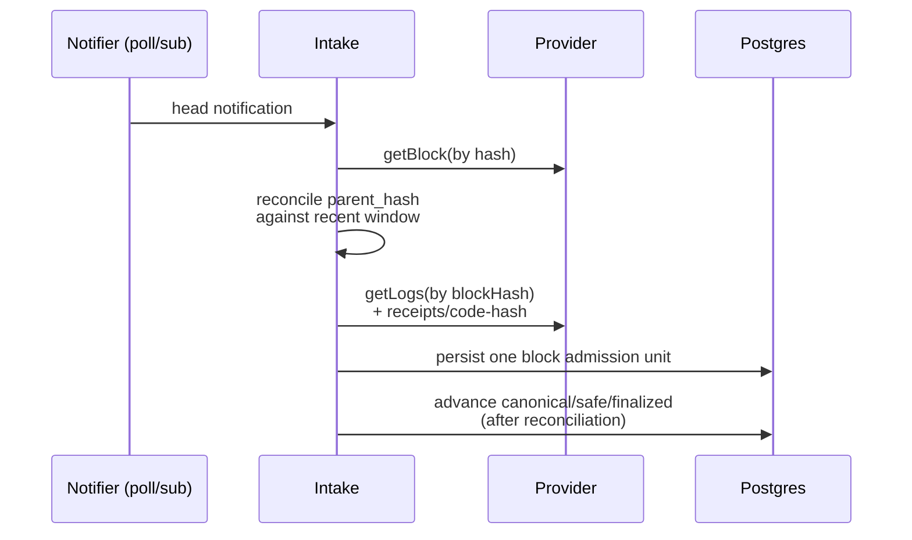

# Chain intake

Intake reconciles a canonical chain and writes a fact log alongside it. Subscriptions, filters, and notifications are latency hints; raw facts are append-only; canonicality and head promotion are explicit state. **Block hash is identity; block number is position.** Live ingestion and backfill share the same downstream pipeline.

A deployment selects one chain profile at a time. Mainnet and Sepolia facts don't share a canonical corpus, checkpoints, or projection state. The ENSv2 `sepolia-dev` profile selects `manifests-sepolia-dev/` as a whole alternate root and must not load alongside `manifests/` in the same intake runtime, watch plan, discovery graph, or projection set.

This file covers reconciliation, fetch, notification, backfill, and replay. The model and read contract are in [`architecture.md`](architecture.md). Persistence is in [`storage.md`](storage.md). Manifest and discovery rules are in [`manifests.md`](manifests.md).

## Scope

The truth-core intake covers durable replay facts and cache metadata for:

- blocks and lineage metadata
- selected and admitted target logs
- transaction, receipt, and block fields needed to decode selected logs or rebuild retained normalised events and execution outputs
- code-hash observations
- block-anchored call snapshots used by verified execution or enrichment
- optional cache metadata or digests for large block, transaction, or receipt bodies fetched outside the hot replay set

Block-anchored `raw_call_snapshots` remain intake-owned raw facts even when verified execution supplied the candidate request/response pair. Execution may hand off only snapshots anchored to the resolved requested chain position and only for a persistence path that already admits those snapshots.

Out of scope: mempool/pending-transaction indexing, node-local txpool APIs, client-specific trace or state-diff indexing as a correctness dependency, historical state reconstruction from non-archive upstreams. Any of these may exist later as separate capabilities; they don't enter the core correctness model.

## ENSv1 and Basenames resolver discovery

ENSv1 old-registry intake is migration-aware historical admission, not a second current-registry stream. `ENSRegistryOld` stays under `ens_v1_registry_l1` as an allow-listed migration-epoch input at `0x314159265dd8dbb310642f98f50c066173c1259b` with `start_block = 3327417`[^subgraph-l39]. The current-registry `start_block: 9380380` is the current registry's pinned start, not original ENS history[^subgraph-l15].

Old-registry raw facts retain their emitter identity and pass a migration guard before they normalise into current topology. A current-registry `NewOwner` marks the affected subnode migrated; later old-registry `NewOwner`, `Transfer`, `NewTTL`, and non-root `NewResolver` observations for that node are retained as facts but don't overwrite current topology[^subgraph-ts-l134][^subgraph-ts-l230][^subgraph-ts-l238][^subgraph-ts-l246]. The root resolver is the single exception: old-registry `NewResolver(ROOT_NODE, _)` may still update the root binding[^v1-ensregfb-l40].

Resolver discovery feeds declared record indexing. Static manifest admission is not enough.

- ENSv1 `NewResolver(node, resolver)` from admitted `ens_v1_registry_l1` emitters produces resolver discovery for `ens_v1_resolver_l1`. Nonzero addresses create or refresh the node-to-resolver binding plus the resolver contract instance; the zero address closes the affected binding[^v1-ensreg-l89].
- Basenames `NewResolver(node, resolver)` from admitted `basenames_base_registry` emitters produces resolver discovery for `basenames_base_resolver`. Same nonzero/zero rules on Base[^bn-registry-l132].

The resolver address observed in topology isn't enough by itself. Contract-instance admission, node-to-resolver binding state, generic event intake, and supported resolver-profile admission are separate concerns.

For ENSv1, retained generic resolver-local record/version events (`AddrChanged`, `AddressChanged`, `TextChanged`, `VersionChanged`) feed observed selector/cache and version-boundary facts when emitter and node match the selected binding. Unobserved selectors stay explicit gaps or `resolver_family_pending`. Generic resolver-topic intake is topic-first: a raw log whose payload can't ABI-decode to the upstream resolver event shape is retained but doesn't emit observed selector/cache or version-boundary facts.

Resolver-profile admission gates complete record-family coverage, resolver-overview completeness, resolver-local authorisation semantics, latest-only behaviour, and event-to-onchain-call parity. The first dynamic resolver-profile admission for ENSv1 is limited to ENS Labs PublicResolver-generation profiles. Per-generation admission may use direct manifest admission, first-party known-resolver admission, stored code-hash observations, proxy/implementation edges, or another explicit non-schema admission rule. Registry `NewResolver` observation alone is not enough. Unknown dynamic resolvers keep explicit `pending` or `unsupported` profile state. ENSv1 admission does not widen Basenames resolver-profile support[^bn-l2resolver-l22].

## ENSv2 `sepolia-dev` adapter intake

`sepolia-dev` intake starts from four admitted source families: `ens_v2_root_l1`, `ens_v2_registry_l1`, `ens_v2_registrar_l1`, `ens_v2_resolver_l1`. Direct watched roots come from the pinned upstream `sepolia-dev` deployment metadata for `RootRegistry`, `ETHRegistry`, `ETHRegistrar`. `PermissionedResolverImpl` is implementation metadata for discovered or admitted resolver instances; resolver instances enter the watch plan only through manifest admission or discovery edges.

ENSv2 adapters normalise log-derived facts after raw block admission:

- `TokenResource(tokenId, resource)` → `TokenResourceLinked`. `TokenRegenerated(oldTokenId, newTokenId)` → `TokenRegenerated` (not a new resource)[^v2-iperm-l34][^v2-events-l69].
- `SubregistryUpdated`, `ResolverUpdated`, `ParentUpdated` become graph and topology events after their endpoint addresses resolve to current `contract_instance_id` values for the selected profile.
- `AliasChanged` becomes `AliasChanged` on admitted resolver instances. `EACRolesChanged` becomes resource-, root-, or resolver-scoped permission events after the adapter resolves the upstream EAC resource to bigname identity.

Any ENSv2 enrichment call used to repair or disambiguate a log-derived fact (`getResource(anyId)`, `getTokenId(anyId)`, `getState(anyId)`, `getAlias(fromName)`, EAC role reads) anchors to the same block identity as the raw log. Log-derived state is never rewritten through ambiguous number-only calls.

## Upstream requirements

For each chain source in the selected profile, the intake plane needs:

- block fetch by hash
- block fetch by number or canonical tag
- log fetch by exact block identity
- receipt fetch for a whole block when supported, with a bounded fallback path
- code and call reads at pinned chain positions
- safe and finalized head visibility

Production correctness depends on `safe` and `finalized` support. Sources that can't surface those checkpoints are bootstrap or shadow sources only. A self-hosted post-Merge Ethereum upstream operates an execution client and a consensus client together. Historical state-heavy enrichment requires archive-capable upstreams, a separately retained durable replay corpus, or explicit fail-closed behaviour when the cache-fill path can't satisfy its block-hash-scoped fetch and retained-digest checks. Upstream history retention is bounded; intake retains its own durable hot replay facts for deterministic replay and treats provider re-fetch as a cache-fill path, not a substitute for selected replay facts.

### Provider configuration

`bigname-indexer run` selects one manifest root with `BIGNAME_INDEXER_MANIFESTS_ROOT` and reads provider sources from `BIGNAME_INDEXER_CHAIN_RPC_URLS` and `BIGNAME_INDEXER_CHAIN_RETH_DB_SOURCES`. Each is a comma-delimited list of `<chain>=<value>` entries; chain names match active watched chains for the selected manifest. JSON-RPC values are provider URLs; Reth DB values are local Reth data directories.

Header audit retention is an explicit operational mode. By default, `bigname-indexer run`, `backfill`, and `ops-catchup` persist minimal block anchors only: block hash, parent hash, number, timestamp, and canonicality state. Passing `--retain-header-audit-fields` or setting `BIGNAME_INDEXER_RETAIN_HEADER_AUDIT_FIELDS=true` retains nullable `logs_bloom`, `transactions_root`, `receipts_root`, and `state_root` when the provider returns them. Conflicting non-null audit fields stay an identity mismatch.

At most one provider source may be configured per chain. JSON-RPC is the portable source. A Reth DB source is an optional intake source, not a protocol adapter: ENS and Basenames adapters still consume bigname raw facts and append adapter-owned normalised events. The checked-in Reth reader targets Ethereum Mainnet datadirs; other chains fail closed until they have a chain-specific reader. Reth-backed reads satisfy the same block-hash-first contract as JSON-RPC for heads, exact block payloads, selected logs, receipts, and block-anchored code/state observations. They fail closed when the local Reth store is unavailable, pruned, inconsistent with the selected chain, or can't surface the requested checkpoint or exact historical payload. Live execution and fresh API-time reads remain outside this source boundary.

The provider source list is operational input, not a manifest admission rule. An unset list leaves manifest sync, watch-plan rebuild, and checkpoint row creation available, but provider-backed head fetch and live ingestion stay idle for every active watched chain. Bootstrap JSON-RPC support accepts `http://` endpoints only.

Provider availability is evaluated per profile and per active watched chain. A Base provider is not a global startup prerequisite: an Ethereum-only profile starts without one, and a profile whose Base chain has no provider leaves Base provider-backed intake idle with `unavailable` / `no_provider`. A configured provider for a chain outside the selected profile is invalid; the runtime never ingests across profiles.

## Head model and recent window

Per chain, intake tracks three persisted checkpoints: `canonical_head`, `safe_head`, `finalized_head`.

API consistency maps directly: `consistency=head` reads from canonical, `safe` from safe, `finalized` from finalized.

The intake plane keeps a recent reconciled window keyed by `(chain_id, block_hash)` with `parent_hash`, `block_number`, `timestamp`, and (when retained) `logs_bloom`, `transactions_root`, `receipts_root`, `state_root`. The window detects parent mismatch immediately, walks back to a common ancestor on reorg, backfills short parent gaps, and answers recent canonicality disputes and audits. Number-to-hash mappings inside this window are derived views; the primary key is always block hash.

## Block identity and storage rules

Lineage and raw facts preserve enough to rebuild canonicality without re-scraping chain history.

- Block hash is the identity anchor for every block-scoped object.
- `parent_hash` is required in lineage storage.
- Lineage ancestry repair only requires block hash, parent hash, number, timestamp, and canonicality state. Header audit fields are retained only in auditable mode.
- Every chain-derived raw fact row carries `chain_id`, `block_number`, `block_hash`.
- Live indexing may fetch full block, transaction, and receipt payloads, but Postgres retains only replay-critical hot facts and optional cache metadata for non-critical full bodies.
- Cache metadata is stable enough to explain which payload was fetched. Metadata that may authorise later byte use carries a retained digest, verified before any cached, object-backed, or provider-refetched payload is used.
- Caches key by block hash first; block number is a secondary lookup or pagination aid.
- A downstream key that needs "current block number" resolves it to a block hash before reading block-scoped data.

## Live path

For exact block-scoped data: logs are fetched by `blockHash`, not just block number; providers that can't support that contract aren't acceptable for that path. Receipts are fetched block-scoped first; transaction-by-transaction receipt fan-out is a fallback. Live ingestion never relies on subscription payloads alone as the persisted source of truth.

## Backfill

Backfill uses logs-centric range scans or block-centric receipt or block scans. It runs as persisted, bounded jobs scoped to one selected profile, chain, source selector, scan mode, and explicit block range. The job range is finite at creation time; open-ended tail following remains live intake.

### Automatic bootstrap

`bigname-indexer run` creates historical backfill work from the selected manifest root and materialised watch plan as finite persisted backfill jobs. It does not run an implicit unbounded scanner, tail follower, or address-only fetch path.

Rules:

- Bootstrap runs after manifest sync, discovery admission, watch-plan materialisation, and per-chain checkpoint row setup.
- Active watched chains without configured providers stay idle. Bootstrap doesn't create jobs for a chain whose provider can't supply a finite bootstrap end.
- Bootstrap covers each eligible target from its manifest/discovery admitted start through the finite provider head observed at job creation. It does not cap the start to an arbitrary recent window.
- Each candidate target is the resolved watched target keyed by `contract_instance_id`, source family, chain, normalised address, and effective range. Raw address is never accepted as durable source identity.
- Bootstrap groups eligible targets whose finite ranges overlap into the same raw-fact job segment by default. Source-scoped jobs remain an explicit operational targeting mode for repair or conformance.
- A target with declared `start_block` is eligible from that inclusive block, narrowed by its active watch range and the finite bootstrap end.
- A target with omitted `start_block` is skipped explicitly. Bootstrap doesn't infer the target start from block zero, the current job range start, manifest activation, provider history, or any default.
- Every created job has finite declared range start and end before insertion.
- Creating, reserving, advancing, completing, or failing an automatic bootstrap job follows the same backfill lifecycle as manual jobs and never mutates `canonical_head`, `safe_head`, or `finalized_head`.

Automatic bootstrap is operational intake readiness only. It doesn't add or widen public API routes, route-level coverage, manifest capability flags, ENSv2 profile support, or consumer-replacement meaning.

### Job lifecycle

| State | Meaning |
|---|---|
| `pending` | The job or range exists, no worker owns it. |
| `reserved` | A worker has a lease for the next bounded range checkpoint. |
| `running` | The reserved worker is advancing the range checkpoint through the shared intake path. |
| `completed` | Every range checkpoint reached its declared end. |
| `failed` | The job or range stopped with recorded failure metadata; retries create or reserve explicit remaining work. |

Each invocation of `bigname-indexer backfill` supplies or reuses an idempotency key for one immutable job shape: profile, chain, source selector, scan mode, finite range start, finite range end. If the key names that exact shape, the existing job is reused. A different shape under the same key fails with an explicit conflict.

### Selector modes

Three mutually exclusive modes:

- **`whole_active_watched_chain`** — default when no selector is supplied. Targets are every active watched target whose active range intersects the finite job range.
- **`source_family`** (`--source-family <family>`) — targets are the active watched targets in that family. Unknown families fail before job creation.
- **`watched_target_set`** — explicit watched-target set. Targets are identified by `contract_instance_id`; raw addresses aren't accepted. The runner doesn't expand to siblings or other targets in the same family.

Persisted source identity is the resolved target set, not the CLI spelling — sorted by `source_family`, `contract_instance_id`, normalised address, effective range. Duplicate identities collapse only when the full canonical tuple matches; conflicting metadata fails job creation. For idempotency-key reuse, the runner compares persisted selector mode and resolved source identity. If the active watch plan has shifted such that the same selector now resolves to a different target set, the same idempotency key conflicts.

Very large selected target sets may use a compact digest form (`source_identity_payload_format=selected_targets_digest_v1`) carrying selector fields, requested target identities, count, digest algorithm, digest of the sorted selected target tuples, a first/last sample, and `source_identity_hash`. The sorted canonical target tuple is the digest input.

### Selected-target intake

Backfill intake for a source-scoped job is selected-target-only and block-hash-scoped. The runner may use block-number ranges to enumerate candidate blocks, but every persisted block-scoped fact or enrichment is anchored to the resolved block hash before admission. A source-scoped job does not opportunistically admit unselected targets that happen to appear in the same block, receipt batch, source family, or chain range.

For ENSv1 generic resolver events, source-scoped or per-target backfill is an operational repair and targeting mode. It is not the default semantic model for generic resolver-local event intake. Full bootstrap and whole-active-watched-chain backfill may combine the generic resolver topic scan with address-scoped source families in one raw-fact range: resolver events are topic-scanned across all emitters, while non-resolver families keep their address-scoped filters. Topic matches whose indexed fields or ABI payload don't match the ENSv1 resolver declaration are retained raw facts but aren't selector/cache evidence.

### Canonicality at admission

When backfill admits finalized or safe historical ranges, persisted lineage, raw facts, and normalised events carry the best canonicality state supported by available checkpoint evidence: `finalized` for ranges proven below the finalized checkpoint, `safe` for ranges proven below the safe checkpoint, `canonical` for reconciled canonical ranges that aren't yet safe. They don't stay `observed` merely because they entered through backfill. If evidence is absent, the storage layer preserves the weaker explicit state. Backfill lifecycle transitions never promote `canonical_head`, `safe_head`, or `finalized_head`.

Source-scoped backfill avoids retaining unselected block-wide transaction, receipt, or full block bodies. If the runner fetches broader payloads to locate or verify selected target facts, the Postgres hot store keeps only selected-target logs and facts, minimal lineage and header anchors, replay-required enrichments, and any cache metadata needed for block-hash-scoped admission. Historical blocks with no selected target facts retain only one `chain_lineage` header anchor for ancestry repair.

### Operational finalized catch-up

Catch-up to the finalized head runs as a sequence of bounded backfill jobs — not a hidden unbounded scanner. Each chunk has an immutable job shape, an idempotency key, a finite start, and a finite end no greater than the finalized head observed for that chain when the chunk is created. Live intake remains responsible for the open-ended tail.

Before reserving or running a chunk, the worker checks current Postgres size, writable free disk, and any configured object-cache budget against the chunk's estimated write amplification. If capacity is below the configured minimum or the estimate would exceed the budget, the chunk pauses or fails with explicit capacity metadata. Capacity failure does not widen the job, drop retained replay facts, downgrade canonicality, or silently switch to retaining fewer selected facts.

Catch-up uses the same selected-target retention contract as other backfill: durable selected facts, lineage and header anchors, selected target logs, and replay-required enrichments are retained, while empty historical blocks and unselected full payloads stay cache or metadata only or absent. Catch-up progress doesn't change route coverage or consumer-replacement meaning.

### Storage helpers

Storage helpers own lifecycle mutation and are idempotent:

- `create_backfill_job` inserts a new bounded job or returns the existing job for the same idempotency key and immutable shape.
- `reserve_backfill_range` atomically claims pending or reclaimable work with a lease owner, lease token, and lease expiry. Duplicate calls by the same active lease holder return the same reservation; expired leases reclaim without duplicating work.
- `advance_backfill_range` requires the current lease and moves the persisted range checkpoint forward monotonically.
- `complete_backfill_range` and `complete_backfill_job` are no-ops when already complete.
- `fail_backfill_range` and `fail_backfill_job` record bounded failure state without rewinding completed checkpoints.

Range checkpoints belong to the backfill job substrate. They record operational fetch and resume progress only; they're never reused as chain checkpoints, projection replay checkpoints, or API consistency checkpoints.

### Shared rules

- Backfill and live ingestion share the same downstream normalisation and projection path after raw fetch.
- Receipt-rich indexing prefers block-scoped receipt ingestion when available.
- Backfill jobs are resumable, idempotent, bounded by explicit checkpoints.
- Backfill completion is not proof of finality; canonical/safe/finalized promotion follows the lineage model.

## Batch and retry rules

Batching applies only to independent work: many block fetches, many exact block-scoped log fetches, many receipt lookups, many code-hash or ABI lookups.

- Later pipeline stages don't assume earlier batched results are canonical until reconciliation finishes.
- Every batch item is retryable independently.
- Partial batch failure doesn't corrupt intake ordering.
- Batch size stays bounded and measurable.

## State enrichment

When intake or execution enriches facts with state reads (calls, storage, balances):

- Anchor the read to the exact block hash whenever the RPC surface supports it.
- Otherwise treat the enriched result as provisional until the source block is at least `safe`.
- Never attach number-based enrichment to a block-scoped fact as if it were reorg-proof.

Historical state-heavy enrichment is an archive requirement, not a best-effort full-node feature.

## Reorg algorithm

Reorg handling is an explicit unwind and replay. For each candidate canonical block:

1. If the block is already known, update checkpoint promotion state only.
2. If `parent_hash` matches the current canonical head, append it.
3. If the parent is missing, backfill parents until continuity or an existing checkpoint.
4. If the parent conflicts with the current canonical head, walk back through the recent window to a common ancestor.
5. Mark the losing branch `orphaned`.
6. Emit deterministic invalidation for normalised events and `execution_cache_outcomes` rows derived from orphaned block identities.
7. Admit the winning branch in canonical order.
8. Move the canonical head pointer last.
9. Promote blocks under safe and finalized checkpoints asynchronously and monotonically.

Reconciliation never depends on ad-hoc deletes or "latest row wins" semantics.

Execution-cache invalidation emitted by reorg repair is block-hash-scoped. It invalidates `execution_cache_outcomes` rows whose dependency set contains an orphaned `(chain_id, block_hash)` or a boundary resolved through one. It does not delete execution traces, execution steps, raw facts, or normalised events; those remain durable replay and audit inputs.

Cache dependencies tie to explicit block-hash-bearing chain positions or boundaries before a verified outcome is treated as reorg-safe. Number-only, tag-only, or dependency-free verified resolution and verified primary-name rows fail closed and aren't served from cache after a reorg check.

## Raw-fact normalised-event replay

Replay is bounded operational tooling over already-persisted canonical raw facts. A replay request selects a finite profile, chain, and block range or explicit block-hash set. Canonical raw facts are rows whose block identity is `canonical`, `safe`, or `finalized`; `observed` and `orphaned` facts are excluded.

The runner performs an upsert-only adapter resync by invoking the same adapter-owned `normalized_events` boundary used after live or backfill raw admission. It reads persisted raw facts, lineage state, optional header-audit state when retained, and the persisted manifest/source identity needed to route those facts. It may advance its own indexer-owned `normalized_replay_*` operational cursor.

Provider re-fetch for block-scoped payloads is allowed only through an explicit block-hash-scoped, retained-digest-checked, fail-closed cache-fill path. If no retained digest exists, the payload can't satisfy that contract. Provider re-fetch never replaces selected replay facts that the docs require Postgres to retain.

The runner does not re-open live intake, create or reserve backfill ranges, advance backfill checkpoints, mutate backfill jobs, promote chain heads, rebuild projections, write public API state, or expose a public route.

Automatic normalised-event replay catch-up uses a single all-source chain cursor over persisted canonical raw facts and replays selected blocks in block order. It does not split catch-up into per-source-family cursors: cross-family adapters need registry, registrar, wrapper, resolver, and reverse-claim facts in the same chronological stream to produce non-overlapping identity intervals. Source-scoped replay remains an explicit repair/backfill selector for bounded target sets.

Selected-target replay scopes are operational scan bounds. For ENSv1 generic resolver-local events, replay may narrow which persisted raw logs the adapter resubmits, but the scope doesn't graduate coverage, mutate resolver profiles, suppress otherwise retained generic resolver observations, or make profile state the source of truth for observed selector/cache facts.

Replay does not delete stale `normalized_events`, purge rows derived from selected blocks, or replace existing payloads for an already-persisted normalised-event identity. Existing identities refresh only through the storage upsert canonicality path; stale conflicting payloads stay a hard storage mismatch.

## Atomicity boundary

The raw admission transaction boundary is one block. That transaction writes:

- one `chain_lineage` header-anchor row for the admitted block
- optional `chain_header_audit` fields when auditable retention is enabled
- hot raw transaction, receipt, and log facts needed for selected replay contracts
- optional cache metadata or digests for non-critical full block-scoped payloads when the retention contract keeps them
- any block-scoped call snapshots captured through the intake-owned raw-fact handoff
- normalised events emitted from those facts
- invalidation signals required by downstream workers

The canonical head pointer writes last inside that admission unit. Projection workers stay downstream and asynchronous, but they consume deterministic block-scoped invalidation and replay inputs so reorg repair stays reproducible.

## Out-of-scope intake

- Pending and mempool indexing — separate product surface.
- Trace and internal-call indexing — separate capability plane (depends on non-standard, client-specific APIs).
- The declared-state truth core does not require traces to be correct.
- If traces enable later, they persist as their own raw facts with the same block-hash anchoring and reorg semantics.

## Observability

Minimum metrics:

- lag to canonical, safe, and finalized heads
- reorg depth histogram
- orphaned block rate
- RPC latency and error rate by method
- partial batch failure rate
- recent-window cache hit/miss rate
- backlog depth
- replay and rewrite duration
- raw-fact normalised-event replay duration and selected canonical block count

Required failure drills:

- dropped subscription connection during a reorg
- duplicate headers at the same height
- missing parent gap that requires parent backfill
- partial batch failures
- crash and resume from a persisted checkpoint
- crash and resume from a persisted backfill range checkpoint
- raw-fact replay restart over the same bounded canonical selection (upsert-only resync)
- safe or finalized promotion lagging canonical intake

## Acceptance rules

The intake contract is acceptable when:

- Live notifications can be lost without losing correctness.
- The system reconciles short forks by hash and parent hash alone.
- Block-scoped data ingestion never depends on ambiguous number-only reads when a block-hash-scoped primitive exists.
- Raw facts are sufficient to rebuild canonical declared state after a reorg or decoder rewrite.
- Backfill reuses the same downstream semantics as live ingestion.
- Raw-fact normalised-event replay upserts only from persisted canonical replay facts without payload replacement, stale-row purge, projection rebuild, public API exposure, or chain/backfill checkpoint mutation.
- Any explicit replay cache refill uses provider re-fetch only as a block-hash-scoped, retained-digest-checked, fail-closed cache-fill path.

---

## Footnotes

[^subgraph-l15]: (upstream: .refs/ens_subgraph/subgraph.yaml:L15 @ ens_subgraph@723f1b6)
[^subgraph-l39]: (upstream: .refs/ens_subgraph/subgraph.yaml:L39 @ ens_subgraph@723f1b6)
[^subgraph-ts-l134]: (upstream: .refs/ens_subgraph/src/ensRegistry.ts:L134 @ ens_subgraph@723f1b6)
[^subgraph-ts-l230]: (upstream: .refs/ens_subgraph/src/ensRegistry.ts:L230 @ ens_subgraph@723f1b6)
[^subgraph-ts-l238]: (upstream: .refs/ens_subgraph/src/ensRegistry.ts:L238 @ ens_subgraph@723f1b6)
[^subgraph-ts-l246]: (upstream: .refs/ens_subgraph/src/ensRegistry.ts:L246 @ ens_subgraph@723f1b6)
[^v1-ensreg-l89]: (upstream: .refs/ens_v1/contracts/registry/ENSRegistry.sol:L89 @ ens_v1@91c966f)
[^v1-ensregfb-l40]: (upstream: .refs/ens_v1/contracts/registry/ENSRegistryWithFallback.sol:L40 @ ens_v1@91c966f)
[^bn-l2resolver-l22]: (upstream: .refs/basenames/src/L2/L2Resolver.sol:L22 @ basenames@1809bbc)
[^bn-registry-l132]: (upstream: .refs/basenames/src/L2/Registry.sol:L132 @ basenames@1809bbc)
[^v2-iperm-l34]: (upstream: .refs/ens_v2/contracts/src/registry/interfaces/IPermissionedRegistry.sol:L34 @ ens_v2@554c309)
[^v2-events-l69]: (upstream: .refs/ens_v2/contracts/src/registry/interfaces/IRegistryEvents.sol:L69 @ ens_v2@554c309)
