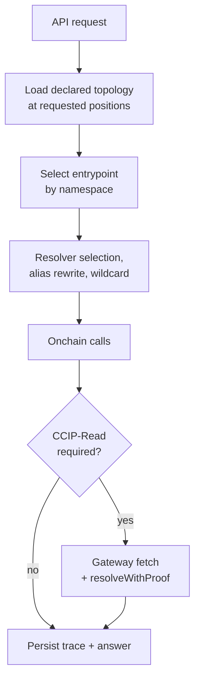
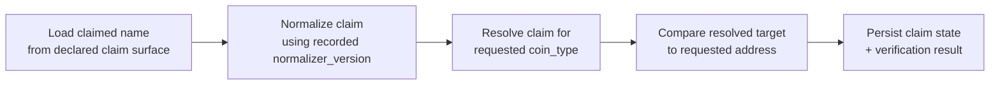

# Verified execution

Verified execution covers two read paths: explicit record resolution by name, and primary-name verification by `(address, coin_type)`. Both consume declared topology snapshots, manifest versions, and the requested chain positions; neither reads adapter-specific internals directly. Companion docs: [`architecture.md`](architecture.md), [`api-v1.md`](api-v1.md), [`storage.md`](storage.md), [`manifests.md`](manifests.md).

Mixed routes return per-result `ResultStatus` from one shared vocabulary: `success`, `not_found`, `mismatch`, `unsupported`, `invalid_name`, `execution_failed`. Verified-only outcomes are `mismatch` and `execution_failed`.

## Resolution flow

Every step is attributable in provenance. One request may cover multiple explicit selectors under one request-scoped trace, returning one `verified_queries` entry per selector. Wildcard traversal and alias rewriting appear explicitly in the trace. Entrypoint selection is attributable to a manifest-declared `source_family` and `role` — registry-family presence alone does not imply it. Admitted exact block-anchored `raw_call_snapshots` stay intake-owned; execution may hand them off as a narrow persistence step but they aren't trace rows.

Before persisting a selector-local result as a supported, cache-eligible outcome, execution reloads from storage the manifest versions, the same declared topology snapshot the mixed route would serve, and any resolver-profile admission state required by participating resolver-local fact families. The namespace support class is derived from those stored inputs, not from transient trace shape. If revalidation can't re-establish a frozen supported class, audit material may persist but supported-outcome persistence fails closed.

Unsupported record families surface explicit `status=unsupported`; they never silently degrade to declared cache values. Supported requests that can't produce a trustworthy answer return `status=execution_failed` with a typed `failure_reason`.

### Entrypoints

| Namespace | Source family | Role | Address |
|---|---|---|---|
| ENS | `ens_execution` | `universal_resolver` | `0xeEeEEEeE14D718C2B47D9923Deab1335E144EeEe` (proxy)[^ens-docs-univ] |
| Basenames | `basenames_execution` v2 | `l1_resolver` | `0xde9049636F4a1dfE0a64d1bFe3155C0A14C54F31` |

The pinned ENSv1 `UniversalResolver` deployment artifact is the implementation/ABI anchor; the route-facing entry is the proxy[^v1-ur-deploy][^v1-ursol-l8]. The same Basenames L1 Resolver address is also referenced by `basenames_l1_compat`, but ownership stays split: `basenames_l1_compat` owns transport attribution; `basenames_execution` owns verified-resolution entrypoint selection. Declared exact-name, address-name, and children reads stay on the Base registry/registrar/resolver families. `basenames_base_primary` is claim intake only.

### On-demand execution

`GET /v1/resolutions/{namespace}/{name}` and `GET /v1/resolve/{name}` with `mode=verified` or `mode=both` are cache-or-live-execute reads for supported Universal Resolver selectors[^v1-iur-l44]. The route first looks for matching persisted execution output at the selected exact-name snapshot. On miss, the API performs Universal Resolver execution against that selected chain position, persists the trace and outcome, and returns the persisted outcome in the same response.

Live-execution rules:

- The execution target is the exact `ChainPositions` selected by the route before any verified-support check; absent `at` and `chain_positions`, this is `consistency=head` and the latest stored checkpoint for the required chain.
- Full resolution and explain/audit execution never retarget to provider latest, a newer checkpoint, or a different snapshot mid-request.
- The API Ethereum RPC provider must be configured (`BIGNAME_API_CHAIN_RPC_URLS=ethereum-mainnet=<url>`) and able to serve the selected Ethereum block; missing configuration or provider unavailability fails with `409 stale` and a configuration message rather than falling back to declared cache.
- Unsupported selector families and unsupported verified path classes stay selector-local `status=unsupported`; on-demand execution doesn't widen the support boundary.
- `GET /v1/explain/resolutions/{namespace}/{name}/execution` is persisted-trace readback only.

The compact records routes (`GET /v1/names/{namespace}/{name}/records`, `GET /v1/resolve/{name}/records`) use the same supported-selector boundary but are current UI reads. When they need on-demand ENS verified values they call the Universal Resolver with the provider `latest` block tag, return the result inline, and don't persist exact-snapshot execution cache rows or `raw_call_snapshots`.

### Namespace inference

For `GET /v1/resolve/{name}`, inference happens before topology load and produces the canonical `{namespace, name}` tuple:

- exact `base.eth` → `namespace=ens`
- `*.base.eth` → `namespace=basenames`
- other supported ENS names → `namespace=ens`

The inferred namespace selects topology, entrypoint, trace namespace, request key, provenance, and cache identity exactly as if the caller had used the canonical route. Namespace inference and verified support are separate gates: an inferred `namespace=basenames` request never retries as `namespace=ens`.

## Primary-name verification

The route keeps claim state separate from the execution-derived verification result. Both `claimed_primary_name` and `verified_primary_name` use `ResultStatus`. `claimed_primary_name` is limited to `success`, `not_found`, `unsupported`, `invalid_name`. `verified_primary_name` adds `mismatch` and `execution_failed`.

`mismatch` means the claim normalised, resolved for the requested `coin_type`, and produced a concrete target address that did not equal the requested one. A nonblank raw claim that can't be normalised surfaces `invalid_name`; blank/whitespace becomes `not_found`. `raw_claim_name` is claim-local — it may be preserved to explain `claimed_primary_name.status=invalid_name` but doesn't migrate into `verified_primary_name`. When verification establishes a concrete normalised target, `verified_primary_name` may carry that name identity for `success` or `mismatch`; it's omitted otherwise.

### Claim sources

| Namespace | Family | Address |
|---|---|---|
| ENS | `ens_v1_reverse_l1` | `0xa58E81fe9b61B5c3fE2AFD33CF304c454AbFc7Cb`[^v1-revreg-l15] |
| Basenames | `basenames_base_primary` | `0x79ea96012eea67a83431f1701b3dff7e37f9e282`[^bn-revreg-l12] |

For ENS, verification reuses `ens_execution` and the Universal Resolver proxy; declared claim ownership and verified execution ownership stay separate[^v1-aur-l217]. For Basenames, claim intake remains separate from the Base authority stack — upstream exposes reverse-name writes through the dedicated `ReverseRegistrar` rather than the Base registry/registrar/resolver. Verification runs through `basenames_execution` against the Mainnet L1 Resolver.

`claimed_primary_name.name`, when present, comes only from the exact requested `primary_names_current(address, coin_type, namespace)` row's declared normalised claim-identity source for that same tuple. It's never synthesised from manifest presence, resolver-backed identity, verified execution identity, tuple presence alone, a different tuple, or any fallback claim source. Missing or unsupported reverse claims do not trigger fallback to registry-, resolver-, or other claim-setting surfaces; the admitted claim source is the reverse-registrar tuple only.

### Coverage and provenance

The exact-tuple verified-primary support class is persisted readback only for the exact route tuple. Both the ENS slice and the first Basenames slice use it; the read path is not a fresh execution entrypoint. Execution identity is `request_type=verified_primary_name`; the request key is the normalised tuple `{namespace}:{normalized_address}:{coin_type}`, where `normalized_address` uses lowercase normalisation. Claimed text, normalised identity, verified target, status, and section-local provenance aren't part of the key.

Supported tuples may publish `coverage.status=partial` with `exhaustiveness=non_enumerable`. Out-of-class tuples remain explicit `unsupported`; they don't inherit coverage from manifest rollout, tuple presence, or verified-resolution support.

`primary_names_current(address, coin_type, namespace)` is the claim-side lookup and invalidation anchor for that tuple. Projection-owned claim state may explain tuple admission or claim invalidation but must not persist `execution_trace_id` or `verified_primary_name`.

Section-local provenance:

- `claimed_primary_name.provenance` is exact-tuple declared-only provenance from the requested row. It strips lookup/invalidation hook material and omits `execution_trace_id`.
- `verified_primary_name.provenance`, when present, is `{execution_trace_id, manifest_versions}`. Its `execution_trace_id` must equal the top-level `provenance.execution_trace_id`; its `manifest_versions` must narrow that same persisted trace.
- Top-level route provenance joins claim-side and verification-side context.

The shipped ENS and Basenames primary-name paths don't require dedicated manifest capability flags. Reverse claim admission stays under `ens_v1_reverse_l1` / `basenames_base_primary`; verified-primary readback stays execution-derived under `ens_execution` / `basenames_execution`.

## Trace schema

Each verified answer persists into `execution_traces`:

- `execution_trace_id`
- request type, request key
- namespace, chain positions, manifest versions
- step list
- contracts called, gateway digests
- final value, failure reason, finished timestamp

For resolution, one persisted answer may carry multiple selector-scoped outputs under the same `execution_trace_id`. For exact-tuple verified primary, one persisted answer covers exactly one `{address, namespace, coin_type}` tuple under `request_type=verified_primary_name`.

Each step row in `execution_steps` records:

- step index, step kind
- input digest, output digest
- latency
- canonicality dependency

Admitted exact block-anchored `raw_call_snapshots` aren't part of this schema. They remain intake-owned raw facts keyed by exact block identity even when verified-resolution persistence hands them off alongside the trace.

Execution traces and steps are durable audit artifacts. Reorg-driven cache invalidation does not delete `execution_traces`, `execution_steps`, object-store attachments, or the trace-local step list — it only changes whether a persisted outcome is reusable as a cache hit.

### Worker inspection

`bigname-worker inspect execution-trace --execution-trace-id <id> --json` is the worker-owned operational read for one persisted trace. Output is limited to already-persisted state: `command`, `execution_trace_id`, request metadata, request type and key, namespace, chain positions, manifest versions, trace status, final value digest, failure reason, finished timestamp, and ordered `steps` entries with index, kind, input digest, output digest, latency, canonicality dependency, and attachment digest metadata.

The command reads `execution_traces`, `execution_steps`, and trace attachment metadata only. It doesn't execute or re-execute resolution, primary-name verification, CCIP calls, or topology discovery; it doesn't expose a public `v1` route, raw execution API, raw gateway transcript, or batch trace dump; it doesn't synthesize topology or resolver/wildcard/alias/transport paths from non-trace storage; it doesn't mutate cache, projections, manifests, discovery, watch plans, or normalised events. The public explain boundary stays intact: `GET /v1/explain/resolutions/{namespace}/{name}/execution` remains the route-local explain view; this command is operational read-only inspection.

## Cache identity and invalidation

Persisted outcomes live in `execution_cache_outcomes`, keyed by:

- request key
- requested chain positions
- manifest versions
- topology version boundary
- record version boundary

For resolution, the request key includes the normalised explicit selector set so the cache boundary matches `verified_queries`. For `GET /v1/resolve/{name}`, the request key is built from the inferred namespace, normalised name, and normalised selector set — namespace-inferred and canonical requests share cache identity after inference.

For verified primary, the request key is the normalised tuple `{namespace}:{normalized_address}:{coin_type}`. The matching `primary_names_current(address, coin_type, namespace)` row is the only admitted claim-side lookup/invalidation anchor; projection updates may invalidate request-matching answers, but the projection doesn't persist verified payloads or trace ids.

Invalidate on:

- reorg
- manifest change
- resolver change
- alias or wildcard topology change
- relevant record change
- primary claim change

Reorg invalidation: reorg repair invalidates any `execution_cache_outcomes` row whose dependency set contains an orphaned block identity. Cache dependencies must tie to explicit block-hash-bearing chain positions or boundaries; block numbers, `latest`/`head` tags, manifest versions, topology versions, and record versions are not sufficient unless they resolve to one or more block hashes or to source rows that carry block hashes. Verified resolution and verified primary-name rows without explicit block-hash-bearing dependencies fail closed and are ineligible for cache reuse after a reorg check. Request types documented as not depending on chain state remain explicitly out of scope rather than implicitly safe. Invalidation affects cache eligibility only; traces, steps, and attachments stay durable.

## Explain

Every verified answer must be explainable through the selected entrypoint, resolver discovery path, wildcard traversal, alias rewriting, CCIP steps, and the final comparison or returned record value. The shipped explain surface for resolution is `GET /v1/explain/resolutions/{namespace}/{name}/execution`.

It's keyed by the same current exact surface and explicit selector set as the mixed route, reads the persisted trace and selector-scoped results, and doesn't re-execute or synthesise from declared topology alone. Top-level provenance and any selector-local provenance anchor to the same persisted `execution_trace_id`. The route surfaces the selected entrypoint, resolver discovery path, wildcard traversal, alias rewriting, and the ordered persisted step summary; CCIP-Read participation appears through persisted step kinds, not a raw gateway transcript.

Public explain support stays coupled to the same verified-resolution support boundary as the mixed route; deferred unsupported path classes don't gain a synthetic trace-shaped public contract. For Basenames, the public execution-explain boundary applies only to execution explain; the separate declared exact-name explain routes stay on the Base-side declared read plane.

## Support boundary

ENS verified resolution on Ethereum Mainnet uses `ens_execution` at the Universal Resolver proxy. Public verified support covers three exact-surface path classes against the same declared topology snapshot used by the mixed route:

| Class | Shape |
|---|---|
| Direct path | `resolver_path[0]` is the route surface; `wildcard.source=null`; `alias.final_target=null`; all `transport=null` |
| Alias-only non-direct | Direct shape, but `alias.final_target` non-null with non-empty `hops` |
| Wildcard-derived | `wildcard.source` non-null with matched labels; `resolver_path[0]` matches `wildcard.source`; `alias.final_target=null`; `subregistry_path=[]`; all `transport=null` |

All three flow through the same persisted execution trace and explain contract: explain surfaces the selected entrypoint, resolver discovery path, ordered persisted steps, and any participating alias or wildcard detail without a second trace family.

ENS requests outside these classes — non-alias ancestor-selected paths, linked-subregistry ancestor-selected paths, any transport-assisted path, and any request whose persisted execution used CCIP-Read — return selector-local `status=unsupported`. The explain route doesn't synthesize public traces for them.

Basenames verified resolution on the shipped mainnet profile uses active `basenames_execution` v2 at the L1 Resolver for the exact-surface transport-assisted direct-path class:

- `resolver_path[0]` matches `data.logical_name_id`
- `wildcard.source=null`, `matched_labels=[]`
- `alias.final_target=null`, `hops=[]`
- `subregistry_path=[]`
- `transport.source_chain_id="base-mainnet"`, `transport.target_chain_id="ethereum-mainnet"`, `transport.contract_address="0xde9049636F4a1dfE0a64d1bFe3155C0A14C54F31"`

CCIP-participating traces are eligible for that class rather than `unsupported`, because upstream `L1Resolver` initiates `OffchainLookup` for non-`base.eth` requests and completes them through `resolveWithProof`[^bn-l1resolver-l154][^bn-l1resolver-l173][^bn-l1resolver-l191]. Explain surfaces the resulting persisted CCIP steps without inventing a second trace family. Other Basenames paths remain `unsupported`.

`GET /v1/resolve/{name}` does not widen this boundary. Inferred Basenames verified selectors return `unsupported` unless the requested snapshot satisfies the same frozen Basenames class.

ENS and Basenames primary-name coverage is graduated only for the exact-tuple persisted-readback class; supported tuples return `coverage.status=partial` with `exhaustiveness=non_enumerable`. Out-of-class tuples, fallback claim sources, richer claimed payloads, fresh verified-primary execution, and namespace-wide claims remain `unsupported` or out of scope. Manifest rollout, capability state, reverse-tuple lookup, and resolver-backed verification detail don't widen the contract on their own.

Declared resolver-profile gaps remain requestable and explicit on the declared read plane; they don't by themselves make a supported verified-resolution path unsupported. Supported Universal Resolver selectors read matching persisted output or execute on demand at the selected snapshot, then persist and return the outcome.

---

## Footnotes

[^ens-docs-univ]: <https://docs.ens.domains/resolvers/universal/>

[^v1-ur-deploy]: (upstream: .refs/ens_v1/deployments/mainnet/UniversalResolver.json:L2 @ ens_v1@91c966f)
[^v1-ursol-l8]: (upstream: .refs/ens_v1/contracts/universalResolver/UniversalResolver.sol:L8 @ ens_v1@91c966f)
[^v1-iur-l44]: (upstream: .refs/ens_v1/contracts/universalResolver/IUniversalResolver.sol:L44 @ ens_v1@91c966f)
[^v1-aur-l217]: (upstream: .refs/ens_v1/contracts/universalResolver/AbstractUniversalResolver.sol:L217 @ ens_v1@91c966f)
[^v1-revreg-l15]: (upstream: .refs/ens_v1/contracts/reverseRegistrar/ReverseRegistrar.sol:L15 @ ens_v1@91c966f)

[^bn-revreg-l12]: (upstream: .refs/basenames/src/L2/ReverseRegistrar.sol:L12 @ basenames@1809bbc)
[^bn-l1resolver-l154]: (upstream: .refs/basenames/src/L1/L1Resolver.sol:L154 @ basenames@1809bbc)
[^bn-l1resolver-l173]: (upstream: .refs/basenames/src/L1/L1Resolver.sol:L173 @ basenames@1809bbc)
[^bn-l1resolver-l191]: (upstream: .refs/basenames/src/L1/L1Resolver.sol:L191 @ basenames@1809bbc)
