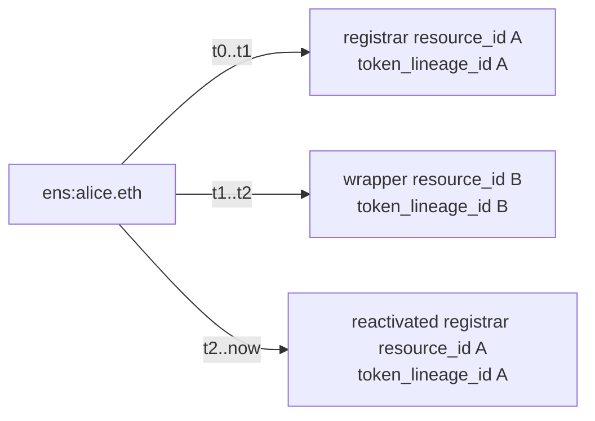

# Storage

Persistence boundaries for raw facts, identity, normalised events, projections, and execution. Architecture model in [`architecture.md`](architecture.md); intake detail in [`chain-intake.md`](chain-intake.md); manifest schema in [`manifests.md`](manifests.md); read model in [`projections.md`](projections.md); execution layout in [`execution.md`](execution.md).

## Invariants

- Durable raw facts are immutable. Evictable cache and non-audit raw-log staging rows lose system-of-record status once their replay contract is satisfied.
- Projections are disposable and rebuildable from canonical raw facts plus normalised events.
- Canonicality is explicit, never inferred from "latest row wins."
- Execution traces and steps are durable audit artifacts; cache outcomes are reusable only while their dependencies remain canonical.
- One write owner per storage family.

## Layers

The system of record splits into six layers:

| Layer | Owner | What's in it |
|---|---|---|
| `chain_lineage` | intake | Block ancestry, fork points, hash-first reconciliation, head promotion. One durable header-anchor per observed block hash. |
| `raw_facts` | intake | Hot indexed replay facts: selected/admitted target logs, the minimum transaction/receipt fields needed to decode them, code-hash observations, fetched call snapshots, optional header/log audit extensions, payload-cache metadata. |
| `manifests_and_discovery` | manifests/discovery | Source manifests, discovered edges, rollout flags. |
| `identity_and_events` | adapters | `NameSurface`, `SurfaceBinding`, `resources`, `token_lineages`, append-only `normalized_events`. |
| `projections` | projection workers | Disposable current-state and collection read models. |
| `execution` | execution workers | Durable traces and steps, `execution_cache_outcomes`, invalidation records. |

Layers 1–5 rebuild current declared state. Layer 6 replays verified answers and explains them.

Worker-owned manifest/proxy alert observations live alongside these layers as an operational audit family. They record drift findings; they aren't manifest truth, discovery admission, projection state, or adapter-owned events.

## Substrates

### Postgres

The hot indexed and replay-focused store. It retains:

- lineage and header anchors needed to reconcile forks, prove ancestry, promote checkpoints, audit canonicality
- selected/admitted target logs and the minimal transaction/receipt fields while they're needed to decode those logs and route them through adapters
- block-scoped call snapshots and enrichments retained by an explicit replay contract
- code-hash observations and discovery/proxy evidence used by manifests, adapter routing, and audit tooling
- compact metadata and optional digests for full payloads fetched as cache

### Hash-addressed object storage

Holds large execution payloads (CCIP bodies, large metadata responses, trace attachments) keyed by SHA-256 digest. Postgres records the digest, size, content type, and object key. Object storage is a durability boundary only for payload classes a doc-first policy explicitly declares durable; for everything else it's evictable cache.

## Raw-log retention modes

`raw_logs`, selected `raw_transactions`, and selected `raw_receipts` have two operational retention modes:

- **minimal** — adapter-replay staging. May be compacted after the normalised replay cursor advances past the retained block range and the corresponding `normalized_events`, identity rows, lineage rows, and projection rebuild inputs are durable.
- **log-audit** — the same rows remain durable audit facts and may keep heavier indexes for historical raw-fact replay.

Switching modes is operational policy. It does not change route coverage, projection truth, canonicality semantics, manifest rollout, or consumer-replacement meaning.

`bigname-worker raw-facts compact-log-staging` is the manual compaction boundary for minimal mode. It refuses to compact unless the `raw_fact_normalized_events` replay cursor is caught up and failure-free, and only operates on raw-log staging families.

After compaction, `chain_lineage` and compact `raw_blocks` remain the block-hash path for losing-branch repair, and `normalized_events` carry the block identity, source identity, event identity, and provenance needed by projection rebuilds and history reads. Reorg repair on an already-compacted range marks normalised events and identity rows orphaned from lineage and updates zero raw-log rows. Historical adapter replay from compacted ranges is an explicit backfill/refetch operation against the configured provider/cache substrate or requires log-audit retention; it isn't an implicit API fallback.

## Evictable payload cache

Large/full block payloads, non-indexed transaction/receipt/block bodies, and non-audit raw-log staging rows are evictable cache by default once the selected replay contract has been satisfied. They may live inline during a hot window, in local/provider cache, in object storage, or not be retained at all.

Retained cache metadata describes what was fetched: payload kind, chain id, block hash/number where block-scoped, optional digest, size, content type or encoding, source observation metadata, observed time, canonicality state. A retained digest authorises later byte use; metadata without one cannot.

Provider re-fetch is an explicit, fallible cache-fill path. For block-scoped payloads it's block-hash-scoped, verifies the retained digest before any bytes are used, and fails closed when the digest is absent, the digest mismatches, or the provider can't serve the exact historical payload. It isn't a substitute for retained lineage, normalised events, execution artifacts, or orphaned-branch audit truth.

Local execution-client storage (e.g. a same-host Reth database) is provider/cache substrate, not a new storage family. Client table keys, row cursors, static-file offsets, and data-directory paths appear only in operational source metadata or evictable cache metadata — never as durable `raw_fact_ref` identities, normalised-event provenance, or projection inputs.

Historical backfill doesn't turn empty blocks into hot payload archives. A block with no selected target logs and no replay-required enrichment retains lineage/header anchors and any compact audit metadata required by the retention policy. Full block bodies, receipt bundles, transaction bundles, and payload-cache bytes for those empty historical blocks remain evictable or absent.

## Identity strategy

### Deterministic text ids

`logical_name_id = "<namespace>:<normalized_name>"` — stable, human-auditable, derivable without database lookup.

### Opaque UUIDs

- `resource_id`
- `token_lineage_id`
- `contract_instance_id`
- `surface_binding_id`
- `execution_trace_id`

UUID values are internal identities, not user-generated strings. `resource_id` and `token_lineage_id` survive projection rebuilds. Token IDs, node hashes, and resolver addresses are attributes, not identity anchors.

### Append-only event ids

`bigint generated always as identity` for raw fact rows, normalised event rows, and projection job rows.

### Continuity rules — adapter contract

These are the rules adapters must follow when minting and reusing identity. The high-level model lives in [`architecture.md`](architecture.md); this section is the storage-side guarantee they depend on.

- One admitted contract address on one chain maps to one stable `contract_instance_id` across all admission epochs. Re-admission after an inactive gap reuses the prior id and records a new non-overlapping active range.
- Proxy contracts and their implementations are separate `contract_instance_id`s. Implementation churn updates the proxy/implementation discovery edge, not the proxy id.
- Contract addresses are time-ranged attributes for raw-fact lookup, log routing, and watch-plan materialisation. Addresses are never the primary key of the source graph.
- For interval identity rows like `surface_bindings`, `active_from` and the stable identity anchors are immutable; `active_to` is replay-derived. Canonical historical replay may tighten an existing non-null `active_to` to an earlier close point when older or more complete facts reveal an earlier end. It does not extend or reopen a closed interval.

For ENSv2, `resource_id` keys by `(chain_id, registry_contract_instance_id, upstream_eac_resource)` after observing the upstream EAC resource — not by the current ERC-1155 token id. Upstream exposes both `getResource(anyId)` and `getTokenId(anyId)`, emits `TokenResource(tokenId, resource)` when a token links to a resource, and emits `TokenRegenerated(oldTokenId, newTokenId)` when role changes burn and mint a replacement token while leaving the resource unchanged[^v2-iperm-l34][^v2-events-l69][^v2-pr-l216][^v2-pr-l451]. Unregister/re-register increments both `eacVersionId` and `tokenVersionId` and mints fresh `resource_id` and `token_lineage_id`.

### ENSv1 authority anchors — worked examples

ENSv1 surfaces rebind across distinct authority anchors: registry-only control, registrar-backed registration, wrapper-backed control. The continuity rules:

- Keep the active `resource_id` while the same anchor stays authoritative across transfer, renewal, expiry, grace, fuse, controller, or resolver changes.
- Rotate the active `resource_id` when authority moves to a different anchor (wrap, unwrap, re-registration after lapse).
- If the prior anchor becomes authoritative again, reuse its prior `resource_id`.
- Direct registry-only control has no `token_lineage_id`. Registrar-backed and wrapper-backed anchors each carry their own.
- Ordinary lifecycle (registry-only control, registrar registration, wrap, unwrap, expiry/grace, transfer, re-registration) uses `binding_kind = declared_registry_path`. Lifecycle changes don't require `migration_rebind`.

Resource-centric convenience: when a single display surface is needed, rank by `declared_registry_path > linked_subregistry_path > migration_rebind > resolver_alias_path > observed_wildcard_path > observed_only`. Ties break by earliest active binding, then lexical `normalized_name`.

### Identity diagram (ENSv1 wrap → unwrap)

The same wrap → unwrap sequence keeps `logical_name_id` constant, opens and closes binding rows, and reuses the prior `resource_id` and `token_lineage_id` when authority returns to the original anchor.

### ENSv2 linked surfaces

Two public surfaces may bind to the same `resource_id`. Permissions and role history stay attached to the resource; surface-specific reads keep their own binding provenance.

### Token regeneration with stable authority

Token regeneration does not change `logical_name_id`, and it does not require a new `resource_id` when the backing authority is the same. Token attributes change within the token-lineage history rather than becoming the primary identity.

### Proxy implementation upgrade

The proxy contract keeps the same `contract_instance_id`. The old proxy/implementation edge closes and a new edge opens to the implementation contract instance for the new implementation address. If a prior implementation address returns later, its prior `contract_instance_id` is reused.

### Declared contract replacement

If a manifest changes a watched contract's own address, the prior contract instance ends and a new `contract_instance_id` begins for the successor deployment. Continuity is represented with a `migration` edge — never by reusing the predecessor's id. If the predecessor address returns later, its prior `contract_instance_id` is reused with a new active range.

## Table families and write ownership

| Family | Write owner | Purpose |
|---|---|---|
| `chain_*` | intake | Lineage and canonical block graph |
| `raw_*` | intake | Immutable hot replay facts and payload-cache metadata |
| `backfill_*` | worker/backfill substrate | Persisted backfill jobs, bounded range leases, resumable range checkpoints |
| `normalized_replay_*` | indexer/replay orchestration | Operational replay cursors |
| `manifest_*` | manifests/discovery | Source manifests, declared contract admission, capability versions |
| `discovery_*` | manifests/discovery | Canonical reachable contract graph; watch-plan expansion keyed by `contract_instance_id` |
| `manifest_alert_*` | worker/audit | Persisted manifest-drift and proxy-alert observations |
| `name_surfaces`, `surface_bindings`, `resources`, `token_lineages` | adapters | Stable identity anchors |
| `normalized_events` | adapters | Append-only normalised protocol events |
| `projection_*` | projection workers | Disposable read models |
| `current_projection_replay_status` | projection workers | Durable operational completion markers for automatic all-current projection replay |
| `execution_*` | execution workers; synchronous indexer/reorg repair for orphan-block cache outcome deletes only | Durable traces and steps; `execution_cache_outcomes` writes; invalidation records |

The API process is read-only against storage.

Within `execution_*`, the only non-execution-worker write owner is synchronous indexer/reorg repair during chain reconciliation. That path may delete or invalidate reusable `execution_cache_outcomes` rows whose dependency set includes an orphaned block identity. It does not write traces, steps, normal outcomes, projections, API state, or manifest state.

For interval identity and normalised authority/permission events, adapters mint and reuse `resource_id`, `token_lineage_id`, and `surface_binding_id` per the architecture identity rules. Projection workers consume those rows; they don't infer alternate continuity or synthesize cross-resource permission carry.

## Manifests and discovery persistence

At minimum:

- `contract_instances` — one row per stable `contract_instance_id` with chain, contract kind, and provenance. Roots use the same identity family.
- `contract_instance_addresses` — time-ranged address attributes keyed by `contract_instance_id`. One id may carry multiple non-overlapping active ranges. Manifest-declared address ranges may carry nullable inclusive `start_block`.
- `discovery_edges` — keyed by `edge_id` with `from_contract_instance_id`, `to_contract_instance_id`, `edge_kind`, active range, provenance, canonicality.
- Materialised watch-plan rows keyed by `contract_instance_id` plus chain and range; root start nodes keyed by the root `contract_instance_id`. Address is a derived watch target, not durable identity. An omitted `start_block` is persisted as null rather than coerced to zero.

Resolver-profile admission state (PublicResolver-generation profiles for ENSv1, `L2Resolver` compatibility for Basenames) is gated separately from contract-instance admission. It may be derived from existing discovery provenance, normalised resolver-discovery events, manifest contract roles, code-hash facts, and proxy/implementation edges; a dedicated profile-fact table isn't required. Profile admission gates complete-family, resolver-overview, latest-only, authorisation, and onchain-call parity claims for the affected resolver instance — not baseline generic resolver-event observation.

`manifest_alert_*` carries an observation identity, observation kind (`manifest_drift` or `proxy_implementation_drift`), lifecycle status, manifest version, source family, chain, contract-instance references, nullable proxy/implementation edge references, expected and observed code-hash or implementation-edge material, derived watch-plan metadata, first/last observed timestamps, and nullable remediation metadata. Writing it doesn't write `normalized_events`, mutate manifest truth, change capability flags, or expose API state. A proxy implementation observation preserves the proxy `contract_instance_id`; implementation churn is represented by an observed or admitted edge, not by minting a replacement proxy identity.

## Backfill persistence

At minimum:

- `backfill_jobs` — one row per bounded backfill job with selected profile, chain, selector kind, resolved source identity, scan mode, declared range start and end, idempotency key, lifecycle status, failure metadata, timestamps.
- `backfill_ranges` — child range records with declared range bounds, next checkpoint, lease owner, lease token, lease expiry, attempt counters, lifecycle status, failure metadata, timestamps.
- Monotonic helper-owned checkpoint fields that let a worker resume after crash without widening the original range or reclassifying already admitted facts.

Operational finalized catch-up uses these same families. It may create many finite chunks, but each chunk preserves one immutable job shape and idempotency key. Capacity preflight (current Postgres size, writable free disk, configured object-cache budget) records explicit failure or paused state in existing lifecycle/failure metadata when capacity is insufficient.

The selector identity fields on a job:

- `selector_kind` — `whole_active_watched_chain`, `source_family`, or `watched_target_set`
- `source_family` — the requested family for `selector_kind=source_family`, otherwise null
- `requested_watched_targets` — caller-supplied watched targets for `selector_kind=watched_target_set`, otherwise empty
- `selected_targets` — the resolved materialised target set sorted by `source_family`, `contract_instance_id`, normalised address, effective from-block, effective to-block
- `source_identity_hash` — digest of `selector_kind`, `source_family`, `requested_watched_targets`, and `selected_targets`

Very large source-family jobs may persist compact selector identity instead of a full `selected_targets` array (`source_identity_payload_format=selected_targets_digest_v1`). The compact form carries `selected_target_count`, `selected_targets_digest_algorithm`, `selected_targets_digest`, a first/last `selected_targets_sample`, and `source_identity_hash`. The digest input remains the sorted canonical `selected_targets` tuple.

`effective_to_block` is finite for every persisted selected target — backfill jobs are finite at creation. Bootstrap ranges start at each eligible target's manifest/discovery admitted start and end at the finite provider head observed at job creation. A watched target whose manifest-declared `start_block` is unknown is skipped by bootstrap; it leaves no synthetic block-zero, provider-history, recent-window, or job-start range in `backfill_*`.

### Backfill range checkpoint vs chain checkpoint

Backfill range checkpoints are operational state. They record only that bounded fetch/resume work reached a position in a declared range. They do not change any `canonicality_state` value and do not advance `canonical_head`, `safe_head`, or `finalized_head`.

Backfill raw admission still writes canonicality for the facts it admits. When the admitted historical range is already proven canonical, safe, or finalized by retained lineage or provider checkpoint evidence, new lineage, raw-fact, and normalised-event rows use `canonical`, `safe`, or `finalized` as appropriate rather than staying `observed` solely because the source was backfill. If evidence is absent, the storage layer preserves the weaker state.

## Partitioning baseline

Partitioned tables:

- `chain_lineage`
- `chain_header_audit` (when auditable retention produces enough rows to justify it)
- `raw_transactions`
- `raw_receipts`
- `raw_logs`
- `normalized_events`
- `execution_steps`

Partition keys: `chain_id` and block-number range. Current-state projection tables start unpartitioned unless measurements prove otherwise.

## Canonicality model

`chain_lineage` persists the recent reconciled block window keyed by `(chain_id, block_hash)`:

- `parent_hash`
- `block_number`
- `timestamp`
- checkpoint-promotion state

Header audit fields are optional retention. The default lineage contract omits `logs_bloom`, `transactions_root`, `receipts_root`, and `state_root`; reorg repair walks backward through `(block_hash, parent_hash)` until it reaches a stored matching ancestor, then marks the losing stored branch and dependent facts noncanonical from that point forward.

An auditable-header retention mode stores those fields in `chain_header_audit` keyed by the same `(chain_id, block_hash)` so inspection tooling can explain or cross-check fetched payloads. Their absence cannot prevent canonicality repair, checkpoint promotion, replay over retained selected facts, or projection rebuilds. When both stored and incoming audit rows carry the same field, mismatches are hard storage conflicts.

`raw_blocks` is not a durable table. Intake, replay, workers, adapters, audit helpers, and tests read block timestamps and canonicality from `chain_lineage` and read optional audit roots/bloom from `chain_header_audit` when auditable retention is enabled. Normal replay batches block-anchor admission once through the `chain_lineage` write boundary.

Every fact-derived row that can be invalidated by reorg carries `chain_id`, `block_number`, `block_hash`, `canonicality_state`, `observed_at`. `canonicality_state` values: `observed`, `canonical`, `safe`, `finalized`, `orphaned`.

Rules:

- block hash is the identity anchor; block number is position only
- fork detection marks affected rows `orphaned`; it does not delete them
- reorg repair preserves lineage and normalised-event/identity canonicality for losing branches as audit truth; log-audit mode also preserves selected raw-log/transaction/receipt facts. Minimal raw-log retention may already have compacted those staging rows
- evictable payload-cache bytes or compacted staging rows do not erase canonicality, normalised-event provenance, or replay-critical evidence retained by the policy
- optional header audit fields are verified when both stored and incoming audit rows carry them. A minimal replay does not conflict with an existing auditable row solely because it omitted those fields
- projection rebuilds read rows that are `canonical`, `safe`, or `finalized` by default; history and audit tools may opt into `observed` and `orphaned` rows
- safe and finalized promotion is monotonic per chain

## Reorg repair

Reorg repair preserves audit truth: orphaned rows persist for explanation and rebuild, not deletion. The losing branch's lineage, identity rows, and normalised events stay canonical-state `orphaned` so explain and history routes can still reconstruct what was observed.

Execution cache rows follow the same hash-first canonicality rule. When reorg repair marks a block identity `orphaned`, synchronous indexer/reorg repair invalidates or deletes any reusable `execution_cache_outcomes` row whose dependency set includes that `(chain_id, block_hash)` or a boundary resolved through it. The invalidation makes the cached outcome ineligible for reuse; it does not delete raw facts, traces, steps, attachments, or any execution-owned audit artifact.

Reusable `execution_cache_outcomes` rows carry dependencies tied to explicit block-hash-bearing chain positions or boundaries. Rows that lack those dependencies fail closed.

## Replay semantics

Raw-fact normalised-event replay is indexer-owned orchestration over the adapter-owned `normalized_events` boundary. It selects bounded canonical raw facts and asks adapters to perform an upsert-only resync; it advances only its own `normalized_replay_*` cursor.

Whole-range replay is the default. Automatic bootstrap and automatic catch-up share one all-source chain cursor over persisted canonical raw facts in block order — adapter-owned identity histories combine registry, registrar, wrapper, resolver, and reverse-claim signals into one storage write boundary, so independent per-source-family cursors would tear those histories.

Source-scoped or per-target replay is an operational repair mode. It narrows the raw-log selection and adapter source scope; it doesn't narrow canonicality, change persisted backfill job identity, delete raw facts from other sources, mutate discovery or manifests, or graduate coverage. Storage helpers, projections, API code, and inspection tooling don't synthesize normalised events outside this boundary.

Replay reads canonical durable hot facts first. It may use a retained durable cold payload only when an explicitly retained replay contract requires that payload. For block-scoped payloads it may use provider re-fetch only through the digest-checked, fail-closed cache-fill path.

Replay does not delete stale `normalized_events` or replace existing payloads for an already-persisted normalised-event identity. The upsert path inserts absent rows and refreshes canonicality for matching identities; conflicting payloads remain mismatches. Adapter-owned identity rows may be marked `orphaned` only when those rows have no backing normalised event, were produced by the same adapter boundary, and would otherwise overlap the incoming identity interval.

Replay does not mutate `chain_*`, `raw_*`, `backfill_*`, `projection_*`, `execution_*`, manifests, discovery rows, public API state, or checkpoint promotion state.

### Adapter repair

Explicit adapter repair is narrower than replay. It exists for deterministic adapter bugs where the persisted normalised-event identity is correct but a small payload field was encoded lossily. Repair is bounded by existing `normalized_events` rows, matches the retained `(chain_id, block_hash, transaction_hash, log_index)` identity, decodes through adapter-owned logic, and updates only documented lossy fields. In minimal raw-log deployments, repair may fetch exact historical logs directly from the configured provider or same-host Reth substrate without re-materialising `raw_logs`.

The currently admitted repair is ENSv1 PublicResolver-compatible `TextChanged` payload repair: legacy generic `RecordChanged` rows with `record_family=text`, `record_key=text`, `selector_key=null` are rewritten to selector-specific `text:<key>` rows; selector-specific text rows missing a retained value have that value filled when the source log verifies against the indexed key hash[^v1-text-l5]. Repair doesn't write `raw_*`, `backfill_*`, projections, manifests, discovery rows, execution rows, or public API state directly.

### Bulk-load index deferral

During fresh normalised replay — current projection tables empty, normalised replay cursor not at target — the indexer may defer normalised-event indexes that exist only for projection/API readback while keeping replay-required indexes for event identity, reverse-claim lookup, and latest resolver/version preloads. Deferred indexes are recreated before projection rebuilds or API-ready declared reads complete.

`current_projection_replay_status` rows let worker restarts resume from the first unfinished projection family instead of restarting bootstrap replay from the start. They are worker-owned operational progress: not API truth, not projection data, and ignored unless the recorded replay version is still current.

## Projection storage rules

Every current-state projection row carries provenance pointers, manifest version, relevant chain positions, canonicality summary, and last-recomputed timestamp.

Projection tables may be truncated and rebuilt from canonical facts plus normalised events.

Exact-name snapshot selection is a storage read boundary, not a new family. The API resolves `at`, explicit `chain_positions`, and `consistency` to one concrete `ChainPositions` object, then reads only projection rows and execution outputs eligible for that exact object. `name_current`, `coverage_current`, `surface_bindings_current`, `permissions_current`, and `record_inventory_current` retain enough chain-position context for the API to reject mismatched joins rather than combine rows from different snapshots.

If the selected positions are valid but no eligible projection or persisted execution output exists, the serving path returns the documented `stale`, `unsupported`, or `not_found` API state. It does not read raw facts, adapter-owned identity/event rows, or provider data directly to fill the public response.

## Execution storage

Inline in Postgres for small payloads:

- request metadata
- response digests
- decoded final values
- failure reasons

In hash-addressed object storage, addressed by SHA-256 digest:

- CCIP payload bodies
- large metadata responses
- trace attachments

Postgres records the digest, size, content type, and object key for each attachment.

`execution_traces` and `execution_steps` preserve what was executed and why. Normal `execution_cache_outcomes` writes record whether a verified outcome can be reused under its request key, manifest versions, and block-hash-bearing dependency boundaries. The reorg-invalidation exception above is the only non-execution-worker write path.

Exact block-anchored `raw_call_snapshots` used by verified resolution stay in the intake-owned `raw_*` family. Execution may hand off candidate snapshots only through the raw-fact boundary, only for the exact requested chain position, and only for support classes that admit them. `execution_traces`, `execution_steps`, and `execution_cache_outcomes` don't own those rows.

Before a verified-resolution selector persists as a supported reusable outcome, execution reloads from storage the exact manifest versions for the request, the same declared topology snapshot a mixed route would serve, and any resolver-profile admission state required by participating resolver-local fact families. The frozen support class derives from those stored inputs and matches the persisted trace and cache key. If those inputs are absent or don't re-establish one frozen class, the trace remains a durable audit artifact but the selector doesn't persist as a supported reusable outcome.

## Read-only inspection tooling

Worker-owned, read-only operational tooling reads storage audit helpers and renders stable JSON. It doesn't create public `v1` routes, mutate state, fetch fresh chain data, or bypass API read boundaries.

| Command | Purpose |
|---|---|
| `bigname-worker inspect canonicality --chain-id <id> --block-hash <hash>` | For a stored block: lineage, parent hash, block number, canonicality state, optional header-audit presence, raw fact counts, payload-cache metadata counts/digests, normalised-event counts. |
| `bigname-worker inspect stored-lineage-range --chain-id <id> --from <block> --to <block>` | Lists only lineage rows already stored for the requested chain and finite block range, ordered by `(block_number, block_hash)`. Renders chain id, block number, block hash, parent hash, canonicality state, timestamp, and stored promotion markers. Nullable fields render as `null`. Doesn't infer missing heights, gaps, span-wide canonicality, or completeness. |
| `bigname-worker inspect backfill-job --backfill-job-id <id>` | Resolves one persisted job and its child ranges. Renders job lifecycle, declared range, selector kind, resolved source identity, idempotency key, timestamps, failure metadata, and a `ranges` array sorted by range bounds and id. |
| `bigname-worker inspect execution-trace --execution-trace-id <id>` | Reads `execution_traces`, `execution_steps`, and trace-attachment metadata for one stored trace. |
| `bigname-worker inspect manifest-drift` / `bigname-worker manifest-drift audit` | Joins stored alert observations to manifest/discovery identifiers, code-hash facts, proxy/implementation edges, and derived watch-target metadata. Doesn't fetch fresh chain state or mutate manifest truth. |
| `bigname-worker inspect watch-plan` | Active watched contracts with source kind, families, instance ids, addresses, and active block ranges. |

## Migrations

- Schema changes land through checked-in migrations only.
- Append-only tables prefer additive changes over destructive rewrites.
- Backfill job and range checkpoint storage lands as additive `backfill_*` tables or additive columns; it doesn't overload `chain_lineage`, projection job state, or public API tables.
- Projection tables may be recreated when the rebuild path already exists.
- Migrations that change a shared interface require the companion doc update first.

## Repository ownership

| Crate / app | Owns |
|---|---|
| `crates/storage` | Migrations, query primitives, backfill helper primitives. |
| `apps/worker` (backfill helpers) | Operational writes to `backfill_*` through helpers, including finalized catch-up chunk creation and capacity pause/failure metadata. |
| `crates/adapters` | Inserts into identity and `normalized_events` tables. |
| `apps/worker` (projections) | Materialised read models. |
| `apps/worker` (execution) | Trace and step writes plus normal cache outcome writes. |
| `apps/indexer` (intake) | Durable hot raw-fact writes plus optional payload-cache metadata. |
| `apps/indexer` (reorg repair) | Synchronous `execution_cache_outcomes` deletes/invalidations tied to orphaned block dependencies (only). |
| `apps/indexer` (replay orchestration) | `normalized_replay_*` cursor; raw-fact normalised-event replay over the adapter-owned `normalized_events` boundary. |
| `apps/api` | Read-only against storage, except documented audit endpoints. |

Replay and inspection tooling may dereference object-backed cache or re-fetch provider payloads only through the digest-checked, fail-closed boundary.

Manifest drift and proxy alerting tooling is worker-owned observation over `manifest_*`, `discovery_*`, code-hash facts, proxy/implementation edges, and derived watch targets. Its live audit path writes only `manifest_alert_*`; its read-only inspection path renders those observations as JSON without writing `normalized_events` or mutating manifest/discovery/projection/API state.

---

## Footnotes

[^v1-text-l5]: (upstream: .refs/ens_v1/contracts/resolvers/profiles/ITextResolver.sol:L5 @ ens_v1@91c966f)
[^v2-iperm-l34]: (upstream: .refs/ens_v2/contracts/src/registry/interfaces/IPermissionedRegistry.sol:L34 @ ens_v2@554c309)
[^v2-events-l69]: (upstream: .refs/ens_v2/contracts/src/registry/interfaces/IRegistryEvents.sol:L69 @ ens_v2@554c309)
[^v2-pr-l216]: (upstream: .refs/ens_v2/contracts/src/registry/PermissionedRegistry.sol:L216 @ ens_v2@554c309)
[^v2-pr-l451]: (upstream: .refs/ens_v2/contracts/src/registry/PermissionedRegistry.sol:L451 @ ens_v2@554c309)
